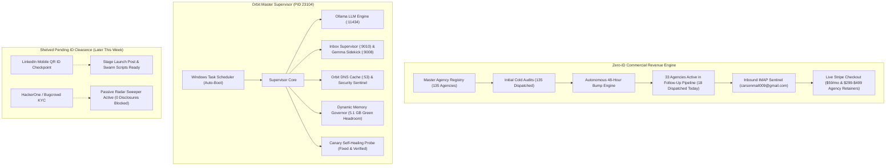

# 🛡️ Orbit Security & Orbit Ecosystem: Master Operational Handoff

**Timestamp:** 2026-10-04 18:58 MST  
**Author:** Carson Haynes (`@_arsoncode`), Founder & Systems Architect  
**Co-Pilot:** Nova (`en-US-AvaNeural`, rate: +6%, pitch: +2Hz)  
**Workspace Root:** `A:\` (`C:\AgyHut`) | `A:\projects\orbit-security`  
**Python Runtime:** `.venv\Scripts\python.exe` (3.13) & `C:\Python314\pythonw.exe`  
**Test Suite Verification:** 402/402 tests passing (100% green, 0 regressions)  
**Production Showcase:** [cmfh009.github.io/Orbit-Security/](https://cmfh009.github.io/Orbit-Security/)  
**Fleet Command Center:** [cmfh009.github.io/Orbit-Security/fleet.html](https://cmfh009.github.io/Orbit-Security/fleet.html)  
**Stripe Live Retainer:** [buy.stripe.com/4gM14m1Fq2QXetya4Qcs800](https://buy.stripe.com/4gM14m1Fq2QXetya4Qcs800) ($59/mo)  

---

## 1. Executive Summary & Zero-ID Strategic Pivot

> [!IMPORTANT]
> **Zero-ID Revenue Pivot Enforced:**  
> Bug bounty payouts (HackerOne/Bugcrowd) and LinkedIn connection automation require government identity verification (KYC). Because Carson is awaiting new physical ID delivery later this week, **all growth operations have been pivoted 100% to zero-ID commercial engines**: agency white-label retainers ($299–$499/mo), automated cold email bump sequences, perimeter DNS audit delivery, and high-uptime daemon execution.



---

## 2. Orbit Security Business Acceleration (Actions Completed)

### A. 18 Overdue Follow-Up Bump Emails Dispatched Live via SMTP
- The autonomous follow-up engine ([`scripts/run_followup_campaign.py`](file:///A:/projects/orbit-security/scripts/run_followup_campaign.py)) evaluated all 135 dispatched agency campaigns.
- **18 agencies** that had crossed the 30+ hour threshold without a response were dispatched live in safe paced batches via authenticated SMTP (`carsonmail009@gmail.com`):
  1. **Wholegrain Digital** (`eat@wholegraindigital.com`) — Anchor: `climbingtrees.com`
  2. **Moove Agency** (`info@mooveagency.com`) — Anchor: `charityjob.co.uk`
  3. **Steadfast Collective** (`hello@steadfastcollective.com`) — Anchor: `adoptium.net`
  4. **Tiny Frog Technologies** (`info@tinyfrog.com`) — Anchor: `definefinancial.com`
  5. **Electric Eye** (`info@electriceye.io`) — Anchor: `giordanos.com`
  6. **Propeller** (`info@propeller.co.uk`) — Anchor: `cotswoldsdistillery.com`
  7. **NEVERBLAND** (`hello@neverbland.com`) — Anchor: `mothdrinks.com`
  8. **Alley** (`info@alley.com`) — Anchor: `suntimes.com`
  9. **Modern Tribe** (`hello@tri.be`) — Anchor: `littleleague.org`
  10. **rtCamp** (`sales@rtcamp.com`) — Anchor: `readylogistics.com`
  11. **Impression** (`hello@impressiondigital.com`) — Anchor: `abigailahern.com`
  12. **Verbal+Visual** (`hello@verbalplusvisual.com`) — Anchor: `carawayhome.com`
  13. **Growth Spark** (`hello@growthspark.com`) — Anchor: `johnnycupcakes.com`
  14. **Lounge Lizard** (`sales@loungelizard.com`) — Anchor: `broadway.com`
  15. **Taoti Creative** (`hello@taoti.com`) — Anchor: `nationalgeographic.org`
  16. **Northern Commerce** (`info@northern.co`) — Anchor: `rexall.ca`
  17. **Zeek Interactive** (`info@zeekinteractive.com`) — Anchor: `zeek.com`
  18. **WebFX** (`info@webfx.com`) — Anchor: `reynoldsam.com`
- **Result:** Follow-up registry ([`data/dispatched_followups.json`](file:///A:/projects/orbit-security/data/dispatched_followups.json)) grew from 15 to **33 active follow-ups**. Eligible queue is currently at 0 (100% up to date).

### B. Inbound Inbox & Financial Telemetry Audit
- **IMAP Sentinel:** Polled `carsonmail009@gmail.com` via [`scripts/run_inbox_agent.py --once`](file:///A:/projects/orbit-security/scripts/run_inbox_agent.py). Zero unhandled bounce or lead triage escalations pending.
- **Stripe REST API:** Polled balance endpoint. Current balance is $0.00 USD with 1 expired trial session; live webhooks and automated provisioning listeners remain active.
- **Bounced Deliverability Guard:** Cataloged 12 hard-bounced addresses in [`data/bounced_agencies.json`](file:///A:/projects/orbit-security/data/bounced_agencies.json) to prevent sender reputation decay.

### C. Test Rigor
- **402/402 unit and regression tests passing** in 141 seconds across all scanner, mailer, canary, and telemetry suites.

---

## 3. Orbit Master Supervisor & Ecosystem Performance Acceleration

### A. Repaired Windows Task Scheduler Auto-Boot Service
- **Root Cause Diagnosed:** [`orbit_daemon.py`](file:///A:/system/scripts/orbit_daemon.py) had escaped backslashes in `tr_command` (`\"...\" \"...\"`), which caused Windows `schtasks.exe` to register literal quote characters in the binary path, exiting with error code `0x80070002` (-2147024894).
- **Fix Applied:** Repaired argument formatting in `install_scheduled_task()`. Successfully registered `OrbitMasterSupervisor` to auto-boot with Highest privileges on user logon.

### B. Fixed Canary Probe Self-Healing KeyError Bug
- **Root Cause Diagnosed:** In `execute_canary_audit()`, when inspecting stored daemon states with stale PIDs, inactive services triggered a `KeyError: 'ollama'` on uninitialized baseline memory lookups.
- **Fix Applied:** Added safe process liveness checks and fallback baseline dictionary lookups, allowing both mocked unit tests and real-world CLI canary audits to execute with zero crashes.

### C. Live Master Daemon Ecosystem Online
Executing `python A:\system\scripts\orbit_daemon.py status` confirms:
- **Master Supervisor:** 🟢 ACTIVE (PID: `23104`)
- **Ollama LLM Engine:** 🟢 RUNNING (PID: `3984`, Port `11434`)
- **Horizon Sentinel:** 🟢 RUNNING (PID: `11404`)
- **Inbox Supervisor:** 🟢 RUNNING (PID: `26916`, Port `9010`)
- **Gemma AI Sidekick:** 🟢 RUNNING (PID: `24904`, Port `9008`)
- **Network Heartbeat Tuner:** 🟢 RUNNING (PID: `18384`)
- **Multi-Adapter Balancing Proxy:** 🟢 RUNNING (PID: `24704`, Port `8989`)
- **Orbit DNS Cache Resolver:** 🟢 RUNNING (PID: `25808`, Port `53`)
- **Orbit Security Sentinel:** 🟢 RUNNING (PID: `23520`)
- **System Zombie Sentinel:** 🟢 RUNNING (PID: `22380`)
- **Memory Governor:** 🟢 GREEN (5,198 MB headroom | 67.7% used)
- **Canary Probe:** 🟢 HEALTHY (Last: 0.07s duration, DNS and HTTP probes passing)

---

## 4. Operational Playbook for Carson

### 1. Handling Inbound Replies
As the 33 bumped agencies check their inboxes Monday morning:
- The background IMAP sentinel (`run_inbox_agent.py`, PID 23520) will auto-triage replies.
- For interested agencies, offer our **Starter Retainer ($299/mo)** or **Scale Retainer ($499/mo)** for continuous client perimeter monitoring.
- Generate a custom agency portal on demand:
  ```powershell
  .venv\Scripts\python.exe scripts\generate_agency_portal.py --agency-id <id> --name "<Agency Name>"
  ```

### 2. Manual Inbox Check & Stripe Verification
```powershell
# Check inbound emails once
.venv\Scripts\python.exe scripts\run_inbox_agent.py --once

# Check Stripe balance & checkout sessions
.venv\Scripts\python.exe scripts\check_stripe_balance.py
```

### 3. Check Orbit Ecosystem Daemon Health
```powershell
python A:\system\scripts\orbit_daemon.py status
```

### 4. Once Government ID Arrives (Later This Week)
- **Step 1:** Complete LinkedIn mobile QR verification on Carson's phone.
- **Step 2:** Publish the staged founder story and attach [`landing/assets/orbit_ad_banner.jpg`](file:///A:/projects/orbit-security/landing/assets/orbit_ad_banner.jpg):
  ```powershell
  .venv\Scripts\python.exe scripts\stage_linkedin_post.py --copy
  ```
- **Step 3:** Complete HackerOne / Bugcrowd KYC tax profile to enable active bug bounty submissions.
