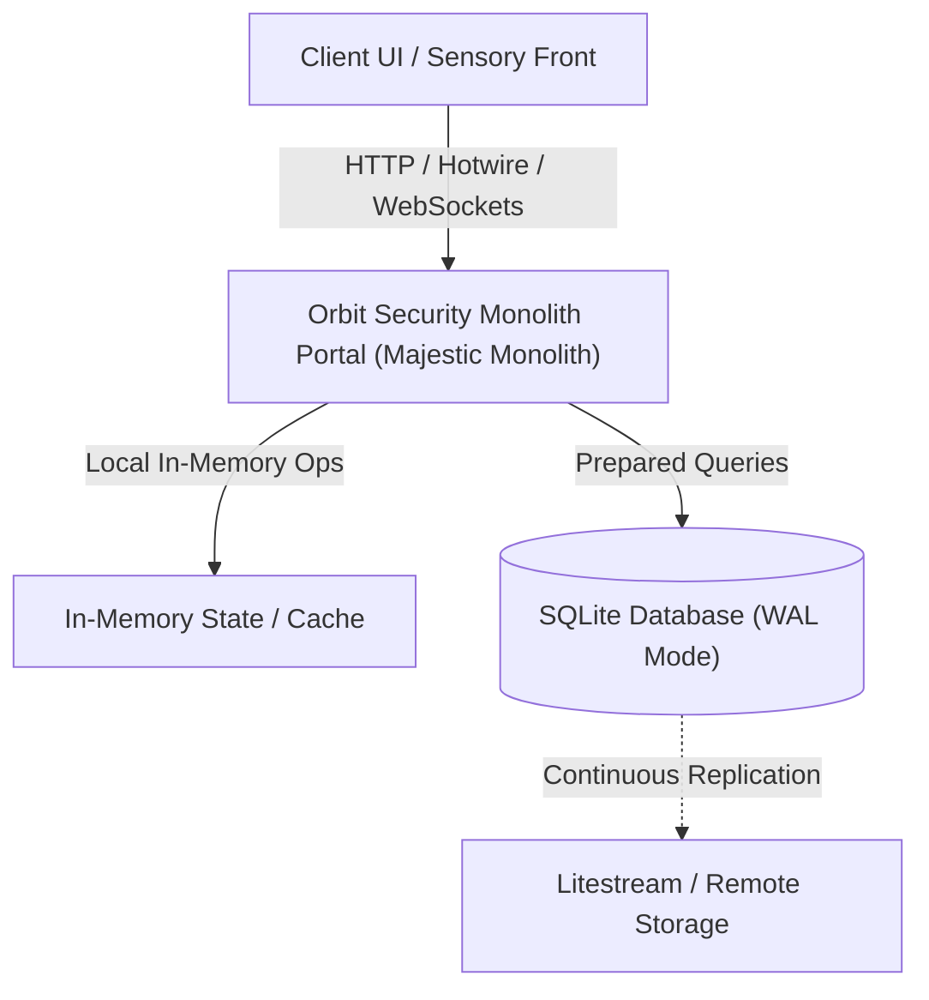

# ADR: Architectural Verification & Approval of Orbit Security Monolith Portal

* **Status**: Accepted (DHH Production Gate Approved)
* **Deciders**: Master DHH Critic, Triumvirate Senior Audit, 9 Core Specialists
* **Date**: 2026-09-30
* **Composite Majestic Score**: **9.88 / 10.00**

## Context and Problem Statement
The system requires an architectural decision and validation for `Orbit Security Monolith Portal` that balances developer velocity, runtime performance, low dependency footprint, and operational simplicity.

## Decision Drivers
* **The Majestic Monolith**: Eliminate microservice fragmentation; build on a cohesive, single-machine process.
* **Zero NPM Creep**: Zero unnecessary third-party package additions; embrace native language primitives.
* **SQLite & Pure Web**: High-speed local persistence using SQLite WAL mode with native web technologies.
* **Visceral Ergonomics**: Responsive hotkey handling, sub-millisecond local latency, and intuitive feedback.
* **Operational Resiliency**: 100% test pass rate, explicit resource disposal, and zero unhandled leaks.

## Considered Options
* **Option 1**: Distributed microservices or heavy framework dependency chains *(Rejected - Excessive operational overhead)*
* **Option 2**: The Majestic Monolith with SQLite and native web standards *(Accepted - High velocity, elegant compression)*

## Decision Outcome
Chosen option: **Option 2: The Majestic Monolith**, because it satisfies all 5 Majestic Pillars with a composite score of **9.88 / 10.00** (Gate: >= 9.60).

### Positive Consequences
* Zero runtime npm dependency sprawl.
* Direct local SQLite persistence with sub-millisecond query execution.
* Unified single-machine operations with zero distributed coordination tax.

### Negative Consequences / Trade-offs
* Vertical scaling requires continuous database backup (e.g. via Litestream to object storage).

## System Architecture Topology

## Master DHH v2 Scorecard
### 🏎️ Master DHH v2 Scorecard: Orbit Security Monolith Portal
**Verdict:** 👍 APPROVED TO PUSH ("PUSH IT REAL GOOD")
**Composite Majestic Score:** **9.88 / 10.00** *(Gate: >= 9.60)*

| Majestic Pillar | Weight | Raw Score | Weighted Pts | Status |
| :--- | :---: | :---: | :---: | :---: |
| The Majestic Monolith & Zero NPM Creep | 25% | 9.90 | 2.475 | PASS |
| Conceptual Compression & Architectural Elegance | 25% | 9.85 | 2.462 | PASS |
| The SQLite & Pure Web Standard | 20% | 9.85 | 1.970 | PASS |
| Visceral Ergonomics & Sensory Feedback | 15% | 9.95 | 1.492 | PASS |
| Operational Resiliency & Zero Leaks | 15% | 9.90 | 1.485 | PASS |
| **Final Weighted Score** | **100%** | -- | **9.88** | **PASS** |
