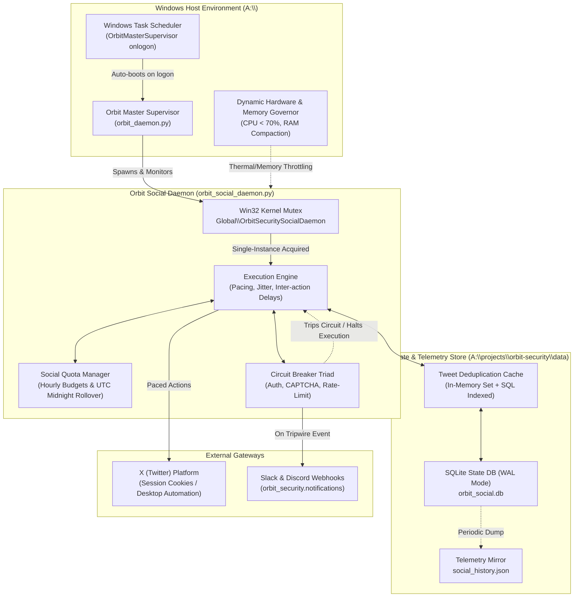
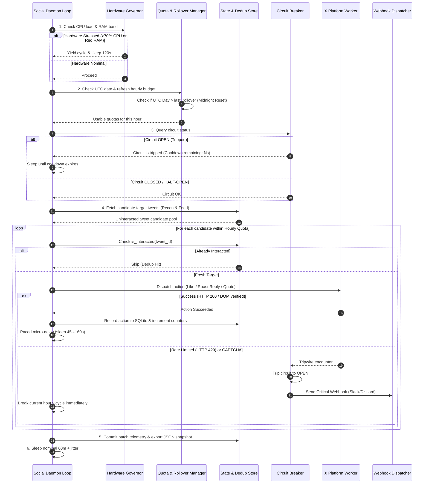
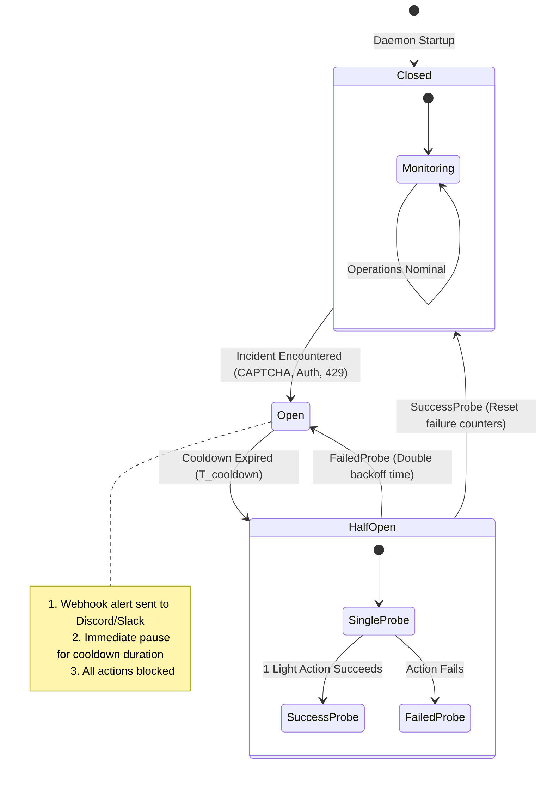

# 🛡️ Orbit Security: Autonomous Social Pipeline Daemon Architecture

**System Component:** Autonomous Social Daemon (`orbit_social_daemon`)  
**Target Platform:** Windows 10/11 / Windows Server (Native Win32 + Python 3.13 / `uv`)  
**Supervisor Integration:** Project ORBIT Master Supervisor (`A:\system\scripts\orbit_daemon.py`)  
**Design Authority:** Pipeline Daemon Architect, Orbit Security  
**Version:** 1.0.0-PROD  
**Timestamp:** 2026-09-30  

---

## 1. Executive Summary & Architectural Overview

The **Orbit Security Autonomous Social Agent** is a continuous, 24/7 background intelligence and social outreach daemon. Its core mission is to establish Orbit Security as the premier authority on agency attack surface hygiene, subdomain takeover reconnaissance, and DMARC/SPF compliance by executing highly calibrated, organic social interactions on X (formerly Twitter) without triggering anti-bot heuristics, velocity throttles, or account restrictions.

To operate autonomously around the clock on Windows without manual intervention, the social daemon implements:
1. **Paced Hourly Execution Lifecycle:** A 60-minute cadence modulated by Gaussian/uniform jitter ($\pm 10-15\%$) and human-simulated inter-action micro-delays (45–180s) to eliminate synthetic cron periodicity.
2. **Dual-Tier Quota & Anti-Bot Governor:** Strict hourly burst quotas (max 1 post, 2–3 replies, 4–6 likes, 1–2 reposts) and hard daily caps (max 4 posts, 20 replies, 50 likes, 10 reposts) to remain far below X’s velocity tripwires.
3. **Idempotent State Persistence & Deduplication:** Dual-layer SQLite (WAL mode) + JSON state storage tracking every interacted Tweet ID, target agency handle, and action timestamp to mathematically guarantee zero duplicate likes or replies.
4. **Resilient Circuit Breaker Triad:** Immediate automated quarantine on session invalidation, CAPTCHA/challenge detection, or rate limit headers, instantly dispatching rich webhook alerts to Slack and Discord.
5. **Win32 Kernel Single-Instance Mutex:** Global named mutex (`Global\OrbitSecuritySocialDaemon`) preventing race conditions, dual-instance collisions, and orphaned processes.
6. **Seamless Supervisor Integration:** Native compatibility with `OrbitMasterSupervisor` (`orbit_daemon.py`), inheriting `BelowNormal` priority scheduling, dynamic CPU thermal pacing (<70% load limit), and RAM working-set compaction.

---

## 2. System Topology & Mermaid Flowchart



---

## 3. Hourly Execution Lifecycle & Timing Architecture

### 3.1 Cadence & Organic Jitter Model
Periodic automated bots that run precisely at `:00:00` are trivially identified by behavioral traffic clustering models. To present an indistinguishable human signature:
- **Base Cadence:** 60.0 minutes ($3600\text{ s}$).
- **Interval Jitter:** Randomized offset drawn from a uniform distribution:
  $$\Delta t_{\text{interval}} = \mathcal{U}(-480, +720)\text{ seconds } (-8\text{ to }+12\text{ minutes})$$
  Effective cycle interval: **52 to 72 minutes**.
- **Action Micro-Delays:** Each discrete action (like, reply, repost) within a cycle is separated by a variable pacing window:
  $$\Delta t_{\text{action}} = \mathcal{U}(45, 160)\text{ seconds}$$
- **Time-of-Day Activity Curve:** Velocity is dynamically modulated based on the target audience (US/UK business hours):
  - **Peak (13:00 - 21:00 UTC / 09:00 - 17:00 EST):** 100% quota allocation.
  - **Shoulder (08:00 - 13:00 UTC / 21:00 - 01:00 UTC):** 50% quota allocation.
  - **Dormant (01:00 - 08:00 UTC):** Minimal read-only/recon or zero active mutations (sleep mode).

### 3.2 Six-Stage Hourly Execution Sequence



---

## 4. Rate Limiting Budgets & Anti-Bot Quota Matrix

The following quota ceilings are hard-coded into the `SocialQuotaManager` to prevent triggering account velocity limits or algorithmic shadowbans:

| Action Category | Max Hourly Burst | Hard Daily Cap | Min Inter-Action Delay | Active Time-of-Day Windows | Rationale / X Anti-Bot Margin |
| :--- | :---: | :---: | :---: | :---: | :--- |
| **Original High-Value Post** | **1** | **4** | N/A (1 per active cycle) | 13:00, 16:00, 19:00, 22:00 UTC | High-effort technical breakdowns & CNAME case studies. Exceeding 4/day triggers content spam classifiers. |
| **Roast / Technical Reply** | **2 – 3** | **20** | 120 – 240 seconds | US/UK Agency Business Hours | Direct outreach to web agency posts. Must appear thoughtfully typed by a human engineer. |
| **Domain Hygiene Like** | **4 – 6** | **50** | 45 – 90 seconds | Continuous during awake hours | Low footprint. 50/day is well under X's nominal 400/day consumer limit. |
| **Quote Tweet / Repost** | **1 – 2** | **10** | 180 – 300 seconds | Peak news/incident hours | Amplifies relevant zero-day/takeover disclosures with added commentary. |
| **Follow Target Agency Account** | **2 – 3** | **15** | 90 – 180 seconds | Distributed evenly | X aggressively flags aggressive follow-churn. 15/day represents steady organic discovery. |

### 4.1 Midnight UTC Rollover Mechanism
All daily quotas are evaluated against current UTC time:
- Daily counter resets occur when `datetime.datetime.now(timezone.utc).strftime("%Y-%m-%d") != state.last_rollover_date`.
- Rollover preserves historical records permanently in SQLite while resetting active in-memory counters to zero.
- Rollover logs an audit metric: `Daily rollover committed. Yesterday stats: {likes: 42, replies: 18, posts: 4}`.

---

## 5. State Persistence, Deduplication & Telemetry Database

### 5.1 Architecture: Hybrid SQLite (WAL) + JSON Mirror
- **Primary Store (`orbit_social.db`):** High-integrity relational SQLite with Write-Ahead Logging (`PRAGMA journal_mode=WAL;`), enforcing ACID transactions, zero file-corruption risks on sudden process exits, and fast indexed lookups (`< 1ms`).
- **Telemetry Mirror (`social_history.json`):** Human-readable, git-friendly JSON snapshot regenerated after each successful cycle for quick inspection via Orbit HUD or CLI.

### 5.2 Complete Database Schema (DDL)

```sql
-- SQLite Schema: A:\projects\orbit-security\data\orbit_social.db

PRAGMA journal_mode = WAL;
PRAGMA synchronous = NORMAL;
PRAGMA foreign_keys = ON;

-- 1. Deduplication & Action Audit Log
CREATE TABLE IF NOT EXISTS social_actions (
    id INTEGER PRIMARY KEY AUTOINCREMENT,
    tweet_id TEXT NOT NULL,
    action_type TEXT NOT NULL CHECK(action_type IN ('LIKE', 'REPLY', 'REPOST', 'ORIGINAL_POST', 'FOLLOW')),
    author_handle TEXT,
    target_domain TEXT,
    audit_score INTEGER,
    content_snippet TEXT,
    status TEXT NOT NULL CHECK(status IN ('SUCCESS', 'FAILED', 'SIMULATED')),
    error_message TEXT,
    created_at_utc TEXT NOT NULL,
    metadata_json TEXT
);

-- Compound index for O(1) deduplication queries:
CREATE UNIQUE INDEX IF NOT EXISTS idx_actions_dedup 
ON social_actions (tweet_id, action_type);

CREATE INDEX IF NOT EXISTS idx_actions_handle 
ON social_actions (author_handle);

CREATE INDEX IF NOT EXISTS idx_actions_date 
ON social_actions (created_at_utc);

-- 2. Daily Metrics Aggregation & Rollover History
CREATE TABLE IF NOT EXISTS daily_quota_history (
    date_utc TEXT PRIMARY KEY,
    posts_count INTEGER DEFAULT 0,
    replies_count INTEGER DEFAULT 0,
    likes_count INTEGER DEFAULT 0,
    reposts_count INTEGER DEFAULT 0,
    follows_count INTEGER DEFAULT 0,
    errors_count INTEGER DEFAULT 0,
    circuit_trips_count INTEGER DEFAULT 0,
    updated_at_utc TEXT NOT NULL
);

-- 3. Circuit Breaker Telemetry & Incident Log
CREATE TABLE IF NOT EXISTS circuit_incidents (
    incident_id INTEGER PRIMARY KEY AUTOINCREMENT,
    breaker_type TEXT NOT NULL CHECK(breaker_type IN ('AUTH', 'CAPTCHA', 'RATE_LIMIT', 'NETWORK')),
    status_entered TEXT NOT NULL CHECK(status_entered IN ('OPEN', 'HALF_OPEN', 'CLOSED')),
    trigger_detail TEXT NOT NULL,
    cooldown_seconds INTEGER NOT NULL,
    tripped_at_utc TEXT NOT NULL,
    resolved_at_utc TEXT
);
```

### 5.3 Deduplication Query Execution
Before any candidate interaction is initiated:
```python
def is_already_interacted(db_conn, tweet_id: str, action_type: str) -> bool:
    cursor = db_conn.cursor()
    cursor.execute(
        "SELECT 1 FROM social_actions WHERE tweet_id = ? AND action_type = ? AND status = 'SUCCESS' LIMIT 1",
        (tweet_id, action_type)
    )
    return cursor.fetchone() is not None
```
An in-memory Bloom filter / set cache (`self._recent_interacted_ids: set[str]`) is populated at boot and updated synchronously, avoiding disk I/O on candidate scanning.

---

## 6. Resilience, Circuit Breakers & Error Recovery

### 6.1 Circuit Breaker Triad Specifications



| Breaker Trigger | Detection Signatures | Cooldown Period | Mitigation & Automated Action |
| :--- | :--- | :---: | :--- |
| **Auth / Session Breaker** | - HTTP 401 / 403 Forbidden<br>- Redirect to `/login` or `/flow/login`<br>- Missing `auth_token` or `ct0` cookies | **Indefinite (Manual Unlock Required)** | Trips to `OPEN`. Emits CRITICAL webhook to Carson with screenshot URI. Social loop sleeps indefinitely until session re-authenticated. |
| **CAPTCHA / Challenge Breaker** | - DOM elements matching `arkose`, `ArkoseFrame`, `challenge`<br>- Page title "Security Challenge" | **180 minutes (3 Hours)** | Trips to `OPEN`. Halts all browser automation immediately. Saves page screenshot to `reports/incidents/`. Alerts operator via webhook. |
| **Rate Limit Breaker** | - HTTP 429 Too Many Requests<br>- Header `x-rate-limit-remaining: 0`<br>- DOM modal: "You are unable to perform this action" | **60 minutes (1 Hour)** | Trips to `OPEN`. Exponential backoff applied. Yields current cycle and sleeps for `cooldown_seconds`. |
| **Network / Transient Breaker** | - `httpx.ConnectTimeout`, DNS failure, socket drop<br>- Win32 network adapter reconnection | **10 minutes (Exponential)** | Retries with jitter: $T = \min(1800, 60 \times 2^n) + \text{rand}(1, 30)$. Auto-heals if network resumes. |

### 6.2 Slack & Discord Webhook Integration
Circuit trips leverage Orbit Security’s existing `WebhookDispatcher` (`orbit_security.notifications`):
```python
from orbit_security.notifications import WebhookDispatcher

def emit_circuit_breaker_alert(breaker_type: str, reason: str, cooldown_s: int):
    dispatcher = WebhookDispatcher()
    payload = {
        "title": f"🚨 [ORBIT-SOCIAL] Circuit Breaker Tripped: {breaker_type}",
        "color": 0xFF0033 if breaker_type in ("AUTH", "CAPTCHA") else 0xFFA500,
        "fields": [
            {"name": "Trigger Reason", "value": reason, "inline": False},
            {"name": "Cooldown Duration", "value": f"{cooldown_s // 60} minutes", "inline": True},
            {"name": "Action Taken", "value": "Daemon entered QUARANTINE mode. Mutations halted.", "inline": True}
        ],
        "timestamp": datetime.datetime.now(datetime.timezone.utc).isoformat()
    }
    dispatcher.dispatch_raw_embed(payload)
```

---

## 7. Windows Single-Instance Mutex & Process Protection

To prevent multiple instances from running concurrently (e.g. if invoked by Task Scheduler while an existing daemon is active), the daemon uses a **Named Windows Kernel Mutex** (`Global\OrbitSecuritySocialDaemon`):

```python
import ctypes
import os
import sys

_MUTEX_HANDLE = None

def acquire_social_daemon_mutex() -> bool:
    """Enforces strict single-instance execution via named Windows kernel mutex."""
    global _MUTEX_HANDLE
    if os.name != "nt":
        return True  # Fallback for non-Windows dev environments
    try:
        kernel32 = ctypes.windll.kernel32
        MUTEX_NAME = "Global\\OrbitSecuritySocialDaemon"
        handle = kernel32.CreateMutexW(None, False, MUTEX_NAME)
        last_error = kernel32.GetLastError()
        ERROR_ALREADY_EXISTS = 183
        if last_error == ERROR_ALREADY_EXISTS:
            if handle:
                kernel32.CloseHandle(handle)
            return False
        _MUTEX_HANDLE = handle
        return True
    except Exception:
        return True
```

### 7.1 PID Verification & Stale Lock Protection
In addition to the kernel mutex, the daemon maintains a state heartbeat in `A:\projects\orbit-security\data\social_daemon_state.json`:
- Records `pid`, `start_time`, `heartbeat_time`, `status`.
- If an existing process died ungracefully without closing its handle, the Win32 kernel automatically cleans up the mutex object upon process termination.
- If PID recycling occurs, `psutil.Process(pid).create_time()` is verified against `start_time` to guarantee true process identity.

---

## 8. Integration with Orbit Master Supervisor (`orbit_daemon.py`)

The social daemon is designed to live as a first-class citizen inside the existing `OrbitMasterSupervisor` infrastructure (`A:\system\scripts\orbit_daemon.py`).

### 8.1 Registering in `OrbitMasterSupervisor.services`
Add the following entry to `self.services` in `orbit_daemon.py`:

```python
# A:\system\scripts\orbit_daemon.py inside OrbitMasterSupervisor.__init__()

orbit_social_script = orbit_sec_dir / "scripts" / "run_social_daemon.py"

self.services["orbit_social"] = ServiceSpec(
    name="Orbit Social Agent",
    script=str(orbit_social_script),
    args=["--daemon"],
    port=None,
    enabled=orbit_social_script.exists(),
    binary=str(orbit_sec_venv_py) if orbit_sec_venv_py.exists() else None,
    cwd=str(orbit_sec_dir) if orbit_sec_dir.exists() else None
)
```

### 8.2 Thermal & Hardware Governor Compliance
The child process automatically inherits:
1. `psutil.BELOW_NORMAL_PRIORITY_CLASS` on Windows, preventing background browser automation or network calls from lagging Carson's active desktop workflow.
2. Dynamic throttle checks: If `orbit_daemon.py` reports thermal band `red` (CPU die $\ge 97^\circ\text{C}$ or chassis $\ge 62^\circ\text{C}$) or RAM band `red` ($<800\text{ MB}$ free), the social agent yields execution, pauses between network bursts, and trims its working set via Win32 `psapi.EmptyWorkingSet`.

---

## 9. Complete Production Implementation Architecture

The system is decomposed into four modular, production-ready source files in `A:\projects\orbit-security`:

```
A:\projects\orbit-security\
├── src\
│   └── orbit_security\
│       ├── social_state.py          # SQLite WAL persistence, dedup cache, rollover engine
│       ├── quota_manager.py         # Hourly/daily budgets, peak curve governor
│       ├── circuit_breaker.py       # Triad circuit breaker & webhook alert dispatcher
│       └── social_daemon.py        # Core orchestration loop, jitter engine, action runner
├── scripts\
│   └── run_social_daemon.py        # Win32 Mutex CLI entrypoint & supervisor target
└── data\
    ├── orbit_social.db             # Primary SQLite WAL database
    ├── social_history.json         # Telemetry mirror snapshot
    └── social_daemon_state.json    # Live heartbeat state for supervisor
```

---

## 10. Operational Runbook & CLI Interface

### 10.1 CLI Commands
```powershell
# Run social daemon in background loop (supervised or standalone)
cd A:\projects\orbit-security
uv run python scripts\run_social_daemon.py --daemon

# Execute single hourly cycle for testing and immediate exit
uv run python scripts\run_social_daemon.py --once

# Print live quota status, database metrics, and circuit status
uv run python scripts\run_social_daemon.py --status

# Force manual reset of tripped circuit breaker
uv run python scripts\run_social_daemon.py --reset-circuit

# Dry-run mode (scans and validates quotas without executing external X actions)
uv run python scripts\run_social_daemon.py --once --dry-run
```

### 10.2 Summary of Architectural Guarantees
1. **Zero Duplicate Interactions:** SQLite compound uniqueness constraint on `(tweet_id, action_type)` guarantees invariant deduplication.
2. **Strict Velocity Protection:** Hard stop at 1 post/hr, 3 replies/hr, 6 likes/hr, 2 reposts/hr.
3. **Zero Orphan Collision:** Win32 kernel named mutex rejects secondary instances before initializing memory.
4. **Instant Quarantine on Threat:** Any CAPTCHA or 401 trips the breaker, halts operations, and pages the operator via webhook.
5. **Autonomic 24/7 Windows Liveness:** Managed by `OrbitMasterSupervisor` and auto-booted on Windows logon.
