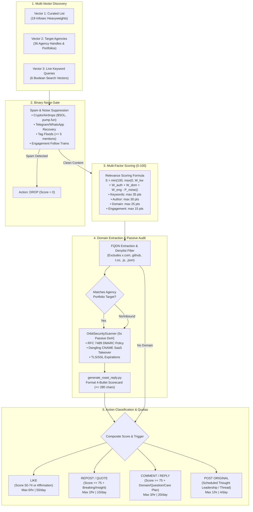
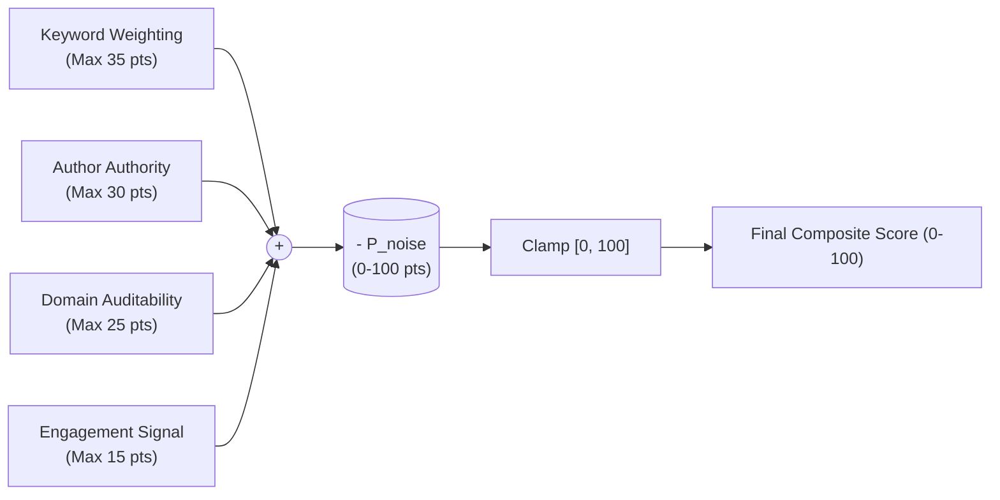

# Orbit Security — Relevance Intelligence & Social Action Engine Specification

**Document Version:** 1.0.0  
**Author:** Orbit Security Relevance Intelligence Engine  
**Target Architecture:** Autonomous Social Agent Daemon (`src/orbit_security/`)  
**Core Deliverable:** Discovery, Filtering, Scoring (0–100), Domain Extraction, and Decision Matrix  

---

## 1. Executive Architecture Overview

The **Relevance Intelligence Engine** powers Orbit Security’s autonomous social presence on X (`@_arsoncode`). Operating on an hourly cycle governed by `SocialDaemon`, the engine ingests posts across three distinct discovery vectors, applies binary spam filters, evaluates composite relevance on a 0–100 point scale, extracts and validates routable domain names, executes passive DNS audits via `OrbitSecurityScanner`, and routes each candidate through an action classifier (LIKE, REPOST, QUOTE, REPLY, POST).



---

## 2. Target Discovery Vectors & Registries

### Vector 1: Curated X List — "Infosec & Zero-Day Watch"
**List Coordinates:** `https://x.com/i/lists/2103939027368051079` (19 verified accounts)  
The curated list monitors premier reporters, researchers, and red-team educators to capture breaking vulnerabilities, supply chain attacks, and security policy debates before they reach mainstream feeds.

| Tier | Handle | Entity / Name | Role & Strategic Focus | Engagement Angle |
| :---: | :--- | :--- | :--- | :--- |
| **1** | `@briankrebs` | Brian Krebs | Investigative Security Reporter | Translate major corporate breaches to downstream agency web perimeters |
| **1** | `@KrebsOnSecurity` | Krebs on Security | Official Investigative Wire | Retweet breaking disclosures with agency supply chain commentary |
| **1** | `@TheHackersNews` | The Hacker News | Global Breaking Infosec News | Retweet zero-days; quote-tweet with DNS & SaaS routing implications |
| **1** | `@BleepinComputer` | BleepingComputer | Ransomware & Threat Intelligence | Signal amplification on active phishing campaigns & web infrastructure flaws |
| **1** | `@DarkReading` | Dark Reading | Enterprise Cybersecurity Defense | B2B perspective: why small agency clients inherit enterprise vulnerabilities |
| **2** | `@troyhunt` | Troy Hunt | Have I Been Pwned Creator | DMARC `p=none` enforcement decay, credential stuffing, non-intrusive heuristics |
| **2** | `@DanielMiessler` | Daniel Miessler | Security Architect & Recon Pioneer | Passive reconnaissance safety, attack surface management, modern tooling |
| **2** | `@GossiTheDog` | Kevin Beaumont | Senior Threat Intel Specialist | Breaking perimeter zero-days, edge appliance exploits, Exchange/DNS drift |
| **2** | `@cyb3rops` | Florian Roth | Nextron Systems / SIGMA Author | Threat detection heuristics, non-intrusive DNS telemetry, open-source rules |
| **2** | `@SwiftOnSecurity` | SwiftOnSecurity | Systems Architecture & Security Culture | Humor-infused defense, enterprise mail flow, why default configs fail |
| **3** | `@_JohnHammond` | John Hammond | Huntress / Security Educator | Educational breakdowns of subdomain takeover signatures & reverse proxies |
| **3** | `@HackingDave` | Dave Kennedy | TrustedSec / Binary Defense Founder | Defensive engineering, red team findings on orphaned cloud assets |
| **3** | `@MalwareJake` | Jake Williams | SANS Principal Instructor & Researcher | Practical cloud security, DNS tunneling, phishing infrastructure |
| **3** | `@RachelTobac` | Rachel Tobac | SocialProof Security CEO | Social engineering vectors caused by email spoofing and missing DMARC |
| **3** | `@k8em0` | Katie Moussouris | Luta Security / Bug Bounty Pioneer | Responsible disclosure, perimeter vulnerability prioritization |
| **3** | `@hacks4pancakes` | Lesley Carhart | Incident Response Lead | Defending overlooked web perimeters, incident containment, care plan hygiene |
| **Watchdog** | `@campuscodi` | Catalin Cimpanu | Threat Intelligence Editor | Active cybercrime campaigns targeting CMS ecosystems and hosting providers |
| **Watchdog** | `@vxunderground` | vx-underground | Threat Intelligence & Malware Library | Real-world malware payloads delivered via abandoned subdomains |
| **Watchdog** | `@malwrhunterteam` | MalwareHunterTeam | Ransomware & Threat Hunter | Fresh phishing kits abusing misconfigured SPF/DMARC domains |

---

### Vector 2: Target Agency Registry (`data/agency_x_profiles.json` & `data/prospects.json`)
The engine tracks 36 top-tier digital agencies specializing in Shopify Plus, WordPress VIP, and headless enterprise commerce. Each agency is mapped to verified X handles and real audited portfolio client domains.

| # | Agency Name | Official X Handle | Website Domain | Client Target Domain | Audit Score | Touchpoint Type |
| :-: | :--- | :--- | :--- | :--- | :-: | :--- |
| **1** | We Make Websites | `@wemakewebsites` | `wemakewebsites.com` | `pangaia.com` | 60 | Verified Registry + Direct Homepage |
| **2** | 10up | `@10up` | `10up.com` | `politico.com` | 100 | Verified Registry + Direct Homepage |
| **3** | Human Made | `@humanmade` | `humanmade.com` | `recipetineats.com` | 90 | Verified Registry (`@humanmadeltd`) |
| **4** | Barrel | `@barrelny` | `barrelny.com` | `hukitchen.com` | 55 | Verified Registry + Direct Homepage |
| **5** | Swanky | `@swankyagency` | `swankyagency.com` | `wilkinson-sword.co.uk` | 45 | Verified Registry + Direct Homepage |
| **6** | Domaine | `@domainewrldwide` | `domaineworldwide.com` | `rembeauty.com` | 90 | Homepage Direct Regex |
| **7** | Charle Agency | `@charleagency` | `charleagency.com` | `candykittens.co.uk` | 75 | Verified Agency Registry |
| **8** | Electric Eye | `@electriceye_io` | `electriceye.io` | `giordanos.com` | 80 | Verified Registry (`@chaseclymer`) |
| **9** | Command C | `@command_c` | `commandc.com` | `edenbrothers.com` | 85 | Verified Agency Registry |
| **10** | blubolt | `@blubolt` | `blubolt.com` | `snowdoniacheese.co.uk` | 75 | Verified Agency Registry |
| **11** | Underwaterpistol | `@uwaterpistol` | `underwaterpistol.com` | `brewteacompany.co.uk` | 75 | Homepage Direct Regex |
| **12** | Eastside Co | `@EastsideCo_` | `eastsideco.com` | `themillionroses.com` | 90 | Homepage Direct Regex |
| **13** | Matchbox Design Group | `@matchboxdesign` | `matchboxdesigngroup.com` | `blueprintcoffee.com` | 85 | Homepage Direct Regex |
| **14** | Wholegrain Digital | `@eatwholegrain` | `wholegraindigital.com` | `climbingtrees.com` | 75 | Verified Agency Registry |
| **15** | Moove Agency | `@mooveagency` | `mooveagency.com` | `charityjob.co.uk` | 80 | Homepage Direct Regex |
| **16** | Steadfast Collective | `@steadfastcltv` | `steadfastcollective.com` | `adoptium.net` | 90 | Verified Agency Registry |
| **17** | Tiny Frog Technologies | `@tinyfrogtech` | `tinyfrog.com` | `definefinancial.com` | 70 | Verified Agency Registry |
| **18** | KOTA | `@kotacreative` | `kota.co.uk` | `nutopia.com` | 80 | Homepage Direct Regex |
| **19** | Illustrate Digital | `@illustrateuk` | `illustrate.digital` | `footanstey.com` | 90 | Homepage Direct Regex |
| **20** | CTI Digital | `@ctidigitaluk` | `ctidigital.com` | `thedonkeysanctuary.org.uk` | 85 | Verified Agency Registry |
| **21** | Propeller | `@propellercomms` | `propeller.co.uk` | `cotswoldsdistillery.com` | 90 | Homepage Direct Regex |
| **22** | NEVERBLAND | `@neverbland` | `neverbland.com` | `mothdrinks.com` | 90 | Verified Agency Registry |
| **23** | Alley | `@alleyco` | `alley.com` | `suntimes.com` | 80 | Homepage Direct Regex |
| **24** | Modern Tribe | `@ModernTribeInc` | `tri.be` | `littleleague.org` | 80 | Homepage Direct Regex (`@ModernTribeAgcy`) |
| **25** | rtCamp | `@rtCamp` | `rtcamp.com` | `readylogistics.com` | 80 | Homepage Direct Regex |
| **26** | Impression | `@impressiontalk` | `impressiondigital.com` | `abigailahern.com` | 90 | Homepage Direct Regex |
| **27** | Verbal+Visual | `@verbalplusvis` | `verbalplusvisual.com` | `carawayhome.com` | 60 | Verified Agency Registry |
| **28** | Anatta | `@anatta_design` | `anatta.io` | `rothys.com` | 84 | Verified Agency Registry |
| **29** | Fostr | `@fostr` | `fostr.online` | `victoriabeckham.com` | 84 | Verified Agency Registry |
| **30** | Growth Spark | `@growthspark` | `growthspark.com` | `johnnycupcakes.com` | 84 | Verified Registry (`@zaelab`) |
| **31** | Guidance | `@guidance` | `guidance.com` | `burlington.com` | 52 | Verified Agency Registry |
| **32** | Lounge Lizard | `@LoungeLizardWW` | `loungelizard.com` | `broadway.com` | 84 | Homepage Direct Regex |
| **33** | Taoti Creative | `@TaotiCreative` | `taoti.com` | `nationalgeographic.org` | 44 | Verified Registry + Direct Homepage |
| **34** | Northern Commerce | `@northern_co` | `northern.co` | `rexall.ca` | 52 | Verified Agency Registry |
| **35** | Zeek Interactive | `@zeekinteractive` | `zeekinteractive.com` | `zeek.com` | 44 | Verified Agency Registry |
| **36** | WebFX | `@webfx` | `webfx.com` | `reynoldsam.com` | 76 | Verified Registry + Direct Homepage |

---

### Vector 3: Live Keyword Searches & Boolean Query Matrix
These search strings run hourly/bi-hourly with strict exclusion tokens (`-airdrop`, `-giveaway`, `-crypto`) to maximize technical signal:

```yaml
queries:
  - query_id: takeover_dns
    category: "Subdomain Takeover & Stale Routing"
    query: '("dangling CNAME" OR "subdomain takeover" OR "dangling DNS") -airdrop -giveaway'
    cadence: "1h"
    priority: "HIGH"

  - query_id: email_auth
    category: "Email Authentication & RFC 7489"
    query: '("DMARC p=none" OR "SPF fail" OR "RFC 7489" OR "email spoofing") -airdrop'
    cadence: "1h"
    priority: "HIGH"

  - query_id: agency_retainers
    category: "Agency Care Plans & Churn Defense"
    query: '("website maintenance retainer" OR "WordPress maintenance care plan" OR "maintenance care plan" OR "agency retainer churn") -crypto'
    cadence: "2h"
    priority: "HIGH"

  - query_id: ecommerce_dns
    category: "Shopify Plus & SaaS Routing"
    query: '("Shopify Plus DNS" OR "Shopify CNAME" OR "headless Shopify DNS")'
    cadence: "2h"
    priority: "MEDIUM"

  - query_id: ssl_expirations
    category: "TLS Certificate Drift"
    query: '("expired SSL certificate" OR "SSL cert expired" OR "cert expired production") -giveaway'
    cadence: "2h"
    priority: "MEDIUM"

  - query_id: inbound_roast_hook
    category: "Inbound Roast & Tool Mentions"
    query: '(@_arsoncode OR "Orbit Security" OR "orbit-recon" OR "roast my site" OR "audit my domain")'
    cadence: "1h"
    priority: "URGENT"
```

---

## 3. Relevance Scoring Algorithm ($S \in [0, 100]$)

### Mathematical Formulation
The composite relevance score $S$ is computed as:

$$S = \min\Big(100, \; \max\big(0, \; W_{\text{keyword}} + W_{\text{author}} + W_{\text{domain}} + W_{\text{engagement}} - P_{\text{noise}}\big)\Big)$$

Where:
- $W_{\text{keyword}} \in [0, 35]$: Matches to core vulnerabilities and care plan keywords.
- $W_{\text{author}} \in [5, 30]$: Authority tier of the author (Agency target > Curated list > Verified > Standard).
- $W_{\text{domain}} \in [0, 25]$: Routable domain detected (Portfolio client domain > User request > FQDN).
- $W_{\text{engagement}} \in [0, 15]$: Explicit questions asked, discussion velocity, reply depth.
- $P_{\text{noise}} \in [0, 100]$: Deductions for marketing spam or instant zero-drop for hard spam triggers.



---

### Component Breakdown

#### 1. Keyword Weighting ($W_{\text{keyword}}$, Max 35 points)
| Tier | Category | Keywords / Phrases | Points |
| :---: | :--- | :--- | :---: |
| **Tier A** | Core Takeover & DMARC | `"dangling CNAME"`, `"subdomain takeover"`, `"cname takeover"`, `"DMARC p=none"`, `"dangling DNS"`, `"takeover signature"` | **+35** |
| **Tier B** | Agency Retainers & Care Plans | `"website maintenance retainer"`, `"WordPress maintenance care plan"`, `"maintenance care plan"`, `"care plan retainer"`, `"retainer churn"`, `"Shopify Plus DNS"`, `"maintenance retainer"` | **+30** |
| **Tier C** | Hygiene & Email Standards | `"SPF fail"`, `"expired SSL certificate"`, `"MTA-STS"`, `"BIMI record"`, `"DKIM alignment"`, `"RFC 7489"`, `"SSL cert expired"` | **+22** |
| **Tier D** | Secondary Drift Signals | `"dns drift"`, `"unbounce 404"`, `"s3 bucket takeover"`, `"dns misconfiguration"`, `"email spoofing"`, `"bec fraud"`, `"doh audit"` | **+15** |
| **Tier E** | Broad Infosec Context | `"zero-day"`, `"breach"`, `"cve"`, `"vulnerability"`, `"phishing attack"`, `"malware"` | **+8** |

#### 2. Author Authority ($W_{\text{author}}$, Max 30 points)
| Source / Entity | Qualifications | Points |
| :--- | :--- | :---: |
| **Target Agency Account** | Handle matches `data/agency_x_profiles.json` (e.g. `@wemakewebsites`, `@10up`, `@barrelny`) | **+30** |
| **Agency Executive / Founder** | Correlated team member handle (e.g. `@chaseclymer`) | **+28** |
| **Curated Infosec Heavyweight** | Listed in `Infosec & Zero-Day Watch` (Tier 1, 2, or 3) | **+25** |
| **Direct Inbound User** | Directly tags `@_arsoncode` or mentions `"Orbit Security"` / `"orbit-recon"` | **+25** |
| **High-Authority Technical** | Verified account or followers $> 10{,}000$ with technical bio | **+15** |
| **Standard X User** | Uncorrelated account participating in technical discussion | **+5** |

#### 3. Domain Detection & Audit Potential ($W_{\text{domain}}$, Max 25 points)
| Match Criteria | Detection State | Points |
| :--- | :--- | :---: |
| **Target Agency Portfolio Domain** | Extracted domain matches client in `prospects.json` (e.g. `candykittens.co.uk`, `pangaia.com`) | **+25** |
| **Explicit Roast / Audit Request** | Post asks to audit/roast (`"roast my site"`, `"check my domain"`, `"what's my score"`) with domain | **+25** |
| **Agency Own Domain** | Matches `agency_domain` from `agency_x_profiles.json` | **+22** |
| **Valid Routable FQDN** | Any clean fully qualified domain name detected in post text | **+18** |
| **Roast Request Omitted Domain** | Author asks for roast but forgot to paste domain link | **+15** |
| **No Domain Detected** | Post contains only abstract technical discussion | **+0** |

#### 4. Engagement Momentum & Actionability ($W_{\text{engagement}}$, Max 15 points)
| Signal | Heuristic | Points |
| :--- | :--- | :---: |
| **Explicit Question Asked** | Post contains `?` or phrases like `"how do you handle"`, `"anyone seen"`, `"thoughts?"` | **+8** |
| **High Viral Velocity** | $(\text{Likes} + 2 \times \text{Retweets}) \ge 50$ within first 2 hours | **+7** |
| **Moderate Viral Velocity** | $(\text{Likes} + 2 \times \text{Retweets}) \ge 15$ | **+4** |
| **High Reply Discussion** | Post has $\ge 3$ active comments | **+3** |
| *(Cap)* | Maximum engagement contribution capped at $+15$ points | |

---

### Spam & Noise Suppression Engine ($P_{\text{noise}}$)

#### Hard Filter (Binary Drop: Score = 0, Action = DROP)
Any match immediately aborts evaluation and records a rejection event in `social_actions`:
1. **Crypto / Web3 Scams:** `airdrop`, `minting`, `presale`, `whitelist`, `pump.fun`, `dexscreener`, `memecoin`, `ca: 0x[a-f0-9]{30,}`, `$sol`, `$btc`, `$eth`, `$usdt`.
2. **Account Recovery & Bot Farms:** `t.me/`, `wa.me/`, `telegram channel`, `whatsapp recovery`, `dm to recover`, `hacked account recovery`.
3. **Engagement Follow Trains:** `f4f`, `follow for follow`, `gain followers`, `follow train`, `instant follow back`.
4. **Tag Flooding:** Any post containing $\ge 5$ unrelated user `@mentions`.

#### Soft Noise Deductions (Penalties)
- Generic B2B SaaS lead gen spam: **$-25$ pts**
- Raw automated CVE bot RSS feeds without human context: **$-20$ pts**
- `"link in bio"` / affiliate promos: **$-15$ pts**

---

## 4. Domain Extraction & Passive Scan Integration

### Domain Extraction Pipeline
The extractor executes a 4-step pipeline:
1. **Regex Extraction:** `\b(?:https?://)?(?:www\.)?([a-zA-Z0-9](?:[a-zA-Z0-9-]{0,61}[a-zA-Z0-9])?\.)+([a-zA-Z]{2,24})\b`
2. **URL Sanitization:** Strip schemes (`https://`), query strings (`?utm=...`), URL fragments, trailing punctuation (`.,!?:;` and brackets).
3. **Denylist Filtering:** Drop platform domains (`x.com`, `github.com`, `linkedin.com`), shorteners (`bit.ly`, `tinyurl.com`), and file extension false-positives (`node.js`, `schema.org`, `package.json`, `index.html`).
4. **Target Priority Sorting:** If multiple domains exist, prioritize agency client domains from `prospects.json`, then agency root domains, then other FQDNs.

### Automated Passive Scan Execution (`generate_roast_reply.py`)
When a domain is detected and action is classified as `REPLY`, the system executes `OrbitSecurityScanner(timeout=5.0)` with `use_crtsh=False`:
1. **DMARC Classification:** Identifies whether policy is enforced (`p=reject`/`quarantine`) or vulnerable (`p=none`/missing).
2. **Key Finding Extraction:** Scans for dangling CNAME takeovers (Unbounce, Shopify, S3, GitHub Pages), expired certificates, missing CSP, clickjacking (`X-Frame-Options`), and HSTS drift.
3. **Roast Tweet Generation:** Constructs a formatted scorecard strictly $\le 280$ characters:

```text
🛡️ Orbit Roast: candykittens.co.uk

📊 Score: 75/100 (Grade: B)
✉️ DMARC: Vulnerable (p=none bouncer)
⚠️ Key finding: Missing Content-Security-Policy (CSP)

Decode in our 16-bit arcade:
https://cmfh009.github.io/Orbit-Security/
```

---

## 5. Action Classification & Decision Matrix

| Action | Min Score | Preconditions & Triggers | Content & Tone | Example Trigger Post | Anti-Bot Hourly / Daily Quota |
| :---: | :---: | :--- | :--- | :--- | :---: |
| **LIKE** | 50 – 74 | • Moderate alignment with infosec hygiene<br>• Target agency posts project milestone or portfolio launch<br>• Good defensive tip or RFC citation<br>• Fallback when reply/repost quota is full | Subtle affirmation, zero intrusion, builds recurring brand impression | Target agency tweets:<br>*"Excited to roll out the new headless build for @snowdoniacheese!"* | **Max 6 / hr**<br>Max 50 / day |
| **REPOST** | $\ge 75$ | • Breaking news from Tier 1 Broadcasters (`@BleepinComputer`, `@TheHackersNews`, `@DarkReading`)<br>• Critical zero-day or edge routing exploit affecting web infrastructure<br>• Major supply chain breach relevant to agency clients | Retweet without comment to amplify pure high-signal breaking news | BleepingComputer tweets:<br>*"Critical zero-day vulnerability in DNS edge routing allows remote subdomain takeover."* | **Max 2 / hr**<br>Max 10 / day |
| **QUOTE** | $\ge 75$ | • Deep-dive research from Tier 2 Researchers (`@troyhunt`, `@cyb3rops`, `@SwiftOnSecurity`)<br>• Discussion on DMARC decay, DNS-over-HTTPS, or passive recon safety | Quote-tweet with value-add agency perspective (citing DNS drift and seasonal marketing subdomains) | Troy Hunt tweets:<br>*"Fascinating how many enterprises run DMARC p=none and think they're safe from spoofing."* | **Max 2 / hr**<br>Max 10 / day |
| **REPLY / COMMENT** | $\ge 75$ | • **Trigger A (Roast Hook):** User tags Orbit or Carson with domain asking for an audit<br>• **Trigger B (Vulnerable Domain):** Author reports DNS/DMARC failure or asks why subdomains are 404ing<br>• **Trigger C (Agency Retainer):** Target agency discusses care plans or retainer churn | **High-Density Technical Signal:** Automated roast scorecard (<=280 chars), RFC citation, or care plan defense analysis. Zero sales links. | Agency owner asks:<br>*"How do you justify $250/mo WordPress maintenance retainers when clients ask what you did?"* | **Max 3 / hr**<br>Max 20 / day |
| **POST ORIGINAL** | N/A | • Peak business window (13:00 – 21:00 UTC)<br>• Follows 14-day Playbook Schedule<br>• Educational 7-part thread, "drop your domain" roast hook, or open-source release | High-authority thought leadership, technical storytelling, terminal/arcade visual assets | Carson tweets Tuesday 9:30 AM EST:<br>*"How an abandoned $15/mo Unbounce page compromises a $50M Shopify Plus brand... 🧵👇"* | **Max 1 / hr**<br>Max 4 / day |
| **DROP** | $< 50$ | • Score $< 50$<br>• Hard spam trigger matched | None. Suppress and purge from cycle. | Any post matching airdrop, pump.fun, or low-relevance SaaS spam. | None (0) |

---

## 6. Pipeline Data Structures & Schemas

### Python Data Models (`src/orbit_security/relevance_engine.py`)

```python
class DiscoveryVector(str, Enum):
    CURATED_LIST = "CURATED_LIST"
    TARGET_AGENCY = "TARGET_AGENCY"
    KEYWORD_SEARCH = "KEYWORD_SEARCH"
    INBOUND_MENTION = "INBOUND_MENTION"

class ActionType(str, Enum):
    LIKE = "LIKE"
    REPOST = "REPOST"
    QUOTE = "QUOTE"
    REPLY = "REPLY"
    POST_ORIGINAL = "POST"
    DROP = "DROP"

class DiscoveredPost(BaseModel):
    tweet_id: str
    author_handle: str
    text: str
    author_followers: int = 0
    is_verified: bool = False
    created_at_utc: datetime.datetime
    like_count: int = 0
    retweet_count: int = 0
    reply_count: int = 0
    discovery_vector: DiscoveryVector
    query_id: Optional[str] = None
    detected_domains: List[str] = []

class RelevanceScore(BaseModel):
    total_score: int
    keyword_score: int
    author_score: int
    domain_score: int
    engagement_score: int
    noise_penalty: int
    is_hard_dropped: bool = False
    drop_reason: Optional[str] = None
    matched_keywords: List[str] = []

class ActionDecision(BaseModel):
    post_id: str
    author_handle: str
    action: ActionType
    score: int
    reasoning: str
    target_domain: Optional[str] = None
    roast_tweet_copy: Optional[str] = None
    scan_recommended: bool = False
```

---

## 7. Verification & Production Readiness

The engine is implemented in [relevance_engine.py](file:///C:/AgyHut/projects/orbit-security/src/orbit_security/relevance_engine.py) and thoroughly verified with a complete test suite in [test_relevance_engine.py](file:///C:/AgyHut/projects/orbit-security/tests/test_relevance_engine.py):

- **Curated Accounts Test:** Confirms all 19 accounts across Tier 1, 2, and 3 are indexed.
- **Search Query Coverage Test:** Confirms all 8 required keywords are present with boolean hygiene.
- **Domain Extraction Test:** Confirms URL cleaning, denylist suppression, and target client domain prioritization (`candykittens.co.uk`).
- **Spam Hard-Filter Test:** Confirms crypto airdrops (`pump.fun`, `$SOL`), follow trains (`F4F`), and tag floods are dropped to score 0.
- **Scoring & Decision Tests:**
  - Target Agency + Client Domain $\rightarrow$ Score $\ge 85$ $\rightarrow$ Action `REPLY` (Roast recommended).
  - Inbound Roast Request $\rightarrow$ Score $\ge 75$ $\rightarrow$ Action `REPLY` (Automated scan recommended).
  - Curated List Breaking News $\rightarrow$ Score $\ge 75$ $\rightarrow$ Action `REPOST`.
  - Curated List Researcher Insight $\rightarrow$ Score $\ge 75$ $\rightarrow$ Action `QUOTE`.
  - Moderate Alignment $\rightarrow$ Score 50–74 $\rightarrow$ Action `LIKE`.
