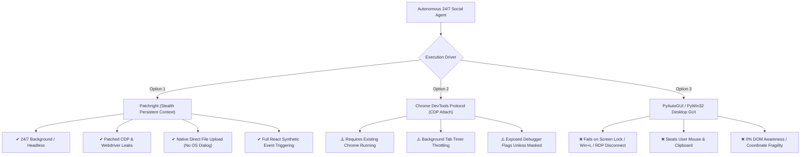
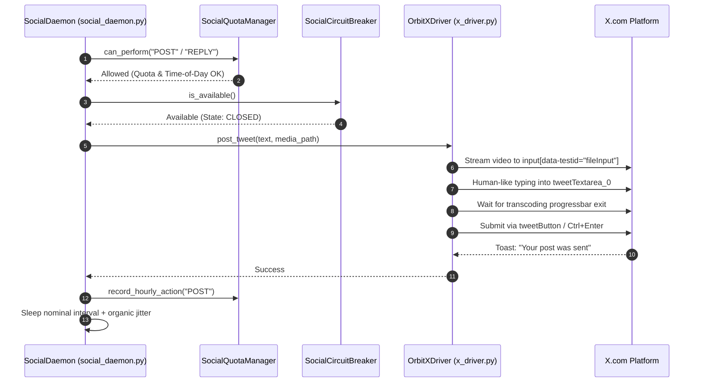

# 🌐 Orbit Security: Autonomous X (Twitter) Browser Automation Architecture

## Executive Summary
This architectural specification provides the production blueprint for Orbit Security's autonomous 24/7 social agent on Windows. It supersedes legacy desktop-automation hacks (`pyautogui`, `pywin32`, clipboard DevTools injection) with **`OrbitXDriver`**, a stealth browser automation engine built on **Patchright** (stealth Playwright fork) with persistent user data directories, rookie-cookies bootstrapping, human kinematics, React Virtual DOM synchronization, and integration with `SocialCircuitBreaker` and `SocialQuotaManager`.

---

## 1. Audit of Existing Automation Scripts

| Script | Mechanism | Fatal Flaws & Vulnerabilities | Verdict |
| :--- | :--- | :--- | :--- |
| [`interact_x.py`](file:///A:/projects/orbit-security/scratch/interact_x.py) | `win32gui.SetForegroundWindow(15992538)` + `pyperclip` paste JS snippet into DevTools console | Hardcoded HWND; hijacks OS clipboard; requires DevTools console open; crashes on window blur/lock. | **Deprecate** |
| [`harvest_feed.py`](file:///A:/projects/orbit-security/scratch/harvest_feed.py) | DevTools console JS injection in 6-scroll loop via `pyautogui` | Blocks user mouse/keyboard; clipboard race conditions; cannot run headless; fails when screen sleeps. | **Deprecate** |
| [`reply_suntimes.py`](file:///A:/projects/orbit-security/scratch/reply_suntimes.py) | Hardcoded screen click `(1120, 835)` + `ctrl+v` + `ctrl+enter` | Broken by resolution change, DPI scaling (125%/150%), or tweet height delta; clicks blind coords. | **Deprecate** |
| [`do_repost_exact.py`](file:///A:/projects/orbit-security/scratch/do_repost_exact.py) | Hardcoded screen click `(1255, 718)` | Any UI reflow or scroll offset causes click to hit dead space or wrong button. | **Deprecate** |
| [`x_campaign_engine.py`](file:///A:/projects/orbit-security/scripts/x_campaign_engine.py) | NumPy pixel matching on `#eff3f4` column 530 + `desktop_automation.py` | Color matching fails across light/dark mode, anti-aliasing, and Windows zoom levels; blocks UI. | **Deprecate** |
| [`test_click_file_input.py`](file:///A:/projects/orbit-security/scratch/test_click_file_input.py) | Console JS click on `input[data-testid="fileInput"]` + Win32 `#32770` dialog hunt | OS Open Dialog hunting is notoriously fragile, subject to focus loss, modal blocking, and path typos. | **Deprecate** |
| [`post_master_ad.py`](file:///A:/projects/orbit-security/scratch/post_master_ad.py) | Click `(1161, 255)` + Win32 Open dialog + 15s blind sleep + `ctrl+v` | High risk of failed upload; blind 15s sleep fails on large videos or network congestion. | **Deprecate** |

---

## 2. Deep Paradigm Comparison: 3 Approaches



### Detailed Evaluation Matrix

| Capability / Requirement | Patchright Persistent Context | CDP Attach (Port 9222) | PyAutoGUI / pywin32 |
| :--- | :--- | :--- | :--- |
| **24/7 Background / Headless** | **Superior (10/10)**: Runs in background process or `--headless=new`. Screen lock, RDP disconnect, or user multitasking do not affect it. | **Moderate (6/10)**: Runs in background tabs, but Chrome aggressively throttles background JS timers (`setTimeout` clamped to 1s). Clashes if user uses the browser. | **Fails (0/10)**: Requires unlocked active desktop (`WinSta0\Default`). Screen lock (Win+L), screensaver, or focus change causes immediate failure. |
| **Anti-Bot Stealth & Evasion** | **Superior (9.5/10)**: Strips CDP `Runtime.enable` artifacts, eliminates `navigator.webdriver`, spoofs WebGL, Canvas, and AudioContext. | **Good (7.5/10)**: Real Chrome binary, but `--remote-debugging-port` triggers DevTools detection unless runtime hooks are masked. | **Poor (3/10)**: While inputs are OS-level, instantaneous clipboard dumps, 0ms coordinate leaps, and console JS pasting are heavily flagged. |
| **Media Uploads (Images/Videos)** | **Superior (10/10)**: `file_input.set_input_files(path)` sets media directly in memory via Chromium DevTools backend. Zero OS dialogs. | **Good (8/10)**: Supported via `DOM.setFileInputFiles`, but requires resolving backend node IDs manually. | **Abysmal (1/10)**: Must trigger native `#32770` dialog, search window hierarchy, type path, hit Enter, and pray focus isn't stolen. |
| **React DOM & Event Dispatch** | **Superior (10/10)**: `locator.fill()` and `page.keyboard.type()` emit trusted synthetic events, automatically notifying React Fiber nodes. | **Moderate (7/10)**: Requires manual dispatch of `Input.dispatchKeyEvent` to trigger React state changes on contenteditable divs. | **Brittle (2/10)**: Relies on `Ctrl+V` or coordinate clicks. No state inspection without clipboard scraping. |
| **Session Persistence** | **Superior (10/10)**: `launch_persistent_context` stores cookies, IndexedDB, and localStorage in `data/x_browser_profile`. Boots via `rookie-cookies`. | **Good (8/10)**: Uses user profile, but closing Chrome terminates automation. | **Poor (2/10)**: Depends entirely on whatever tab happens to be open on screen. |
| **System Usability** | **Zero Impact**: Completely isolated from operator's mouse, keyboard, and clipboard. | **Minor Impact**: Can create new tabs in user's active browser. | **Severe Impact**: Completely hijacks user's workstation. |

---

## 3. DOM Selectors & Dynamic React DOM Resilience

X is a single-page application built on React Native for Web (`r-1...` classes). Class names are randomly hashed on every deploy. **All reliable automation must anchor on semantic `data-testid` attributes.**

### 3.1 Core Selector Mapping

```json
{
  "tweet_container": "article[data-testid=\"tweet\"]",
  "tweet_text": "div[data-testid=\"tweetText\"]",
  "user_name": "div[data-testid=\"User-Name\"]",
  "status_link": "a[href*=\"/status/\"]",
  "like_action": "button[data-testid=\"like\"]",
  "unlike_state": "button[data-testid=\"unlike\"]",
  "retweet_action": "button[data-testid=\"retweet\"]",
  "unretweet_state": "button[data-testid=\"unretweet\"]",
  "retweet_confirm": "div[data-testid=\"retweetConfirm\"]",
  "reply_action": "button[data-testid=\"reply\"]",
  "compose_box": "div[data-testid=\"tweetTextarea_0\"]",
  "submit_button": "button[data-testid=\"tweetButton\"], button[data-testid=\"tweetButtonInline\"]",
  "file_input": "input[data-testid=\"fileInput\"][type=\"file\"]",
  "attachment_preview": "div[data-testid=\"attachments\"]",
  "toast_notice": "div[data-testid=\"toast\"]"
}
```

### 3.2 Solving the Contenteditable Virtual DOM Trap
Setting `.innerText = "..."` or `.value = "..."` on `div[data-testid="tweetTextarea_0"]` bypasses React's synthetic event dispatcher. The React component state does not update, leaving `tweetButton` in an inactive state (`aria-disabled="true"`).

**Solution in `OrbitXDriver`:**
1. Focus the contenteditable element via `locator.click()`.
2. Dispatch native keystrokes via `page.keyboard.type(text)` or `locator.press_sequentially(text)`.
3. If fast pasting is needed, dispatch trusted `Input.insertText` CDP command, which triggers React's `beforeinput` and `input` listeners.
4. Verify the submit button has `aria-disabled="false"` before clicking, or issue `Ctrl+Enter` (`Control+Return`).

---

## 4. Anti-Bot Mitigation & Kinematic Telemetry

### 4.1 Cubic Bezier Mouse Curves
X monitors cursor velocity, acceleration, and angle changes. Instantaneous pointer teleportation (`pyautogui.click(x, y)`) triggers bot scoring.
`OrbitXDriver.HumanKinematics` implements a cubic Bezier curve generator:
$$B(t) = (1-t)^3 P_0 + 3(1-t)^2 t P_1 + 3(1-t) t^2 P_2 + t^3 P_3, \quad t \in [0, 1]$$
- $P_0$: Approximate current mouse coordinates.
- $P_3$: Target element bounding box with Gaussian offset ($x \pm 20\%$, $y \pm 20\%$).
- $P_1, P_2$: Dynamically randomized perpendicular control points simulating human hand/wrist motion.
- Velocity: Ease-in-out easing curve ($t_{\text{eased}} = 3t^2 - 2t^3$) with 15–30ms tick intervals.

### 4.2 Log-Normal Typing Cadence
Robotic fixed intervals (e.g. 50ms) are easily detected. `OrbitXDriver` simulates natural keystrokes:
- Base delay sampled from normal distribution $\mathcal{N}(\mu=80\text{ms}, \sigma=20\text{ms})$, bounded between 40ms and 140ms.
- Cognitive pause: When typing punctuation (`.`, `,`, `!`, `?`) or spacebars, adds a $120\text{ms} - 350\text{ms}$ hesitation delay.

### 4.3 Session Bootstrapping & Rookie-Cookies Integration
To completely avoid interactive login flows (which trigger SMS/email 2FA and phone verification locks):
1. **Extraction**: `OrbitXDriver.import_rookie_cookies("chrome")` reads decrypted `auth_token` and `ct0` cookies directly from the operator's installed Chrome/Edge profile.
2. **Injection**: Cookies are injected into the persistent context before the initial navigation.
3. **Storage**: The persistent context (`data/x_browser_profile`) retains session state across restarts for months without prompting for credentials.

---

## 5. Architectural Integration with Orbit Security Daemon

`OrbitXDriver` is cleanly decoupled and plugs directly into Orbit Security's existing core modules:



### Circuit Breaker Error Tripping:
If X displays an Arkose challenge, account verification lock, or 429 rate limit:
1. `OrbitXDriver.check_for_rate_limits()` catches the toast/redirect.
2. `SocialCircuitBreaker.trip(TriggerType.RATE_LIMIT | CAPTCHA, detail)` enters `OPEN` quarantine mode.
3. Discord and Slack webhooks are dispatched with incident payloads via `WebhookDispatcher`.
4. The daemon pauses operations for 1–3 hours before entering `HALF_OPEN` probe mode.

---

## 6. Implementation Checklist & Migration Path
1. **Core Driver**: Implemented at [`src/orbit_security/x_driver.py`](file:///A:/projects/orbit-security/src/orbit_security/x_driver.py).
2. **Daemon Wire-up**: Replace simulated dispatch lines 166–177 in [`src/orbit_security/social_daemon.py`](file:///A:/projects/orbit-security/src/orbit_security/social_daemon.py) with `OrbitXDriver` calls.
3. **Decommission**: Archive scratch files (`interact_x.py`, `harvest_feed.py`, `reply_suntimes.py`, `post_master_ad.py`).
