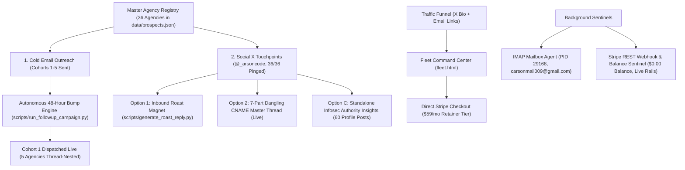

# 🛡️ Orbit Security: Master Operational Handoff (Sunday 2026-09-27)

**Session Timestamp:** 2026-09-27 04:42 MST  
**Author:** Carson Haynes (`@_arsoncode`), Founder & Systems Architect  
**Co-Pilot:** Nova (`en-US-AvaNeural`)  
**Workspace Root:** `A:\projects\orbit-security` (`C:\AgyHut\projects\orbit-security`)  
**Virtual Environment:** `A:\projects\orbit-security\.venv\Scripts\python.exe`  
**Current Git Commit:** `afe3a24` (Pushed to GitHub `main`)  
**Live Production Portal:** [https://cmfh009.github.io/Orbit-Security/](https://cmfh009.github.io/Orbit-Security/)  
**Fleet Command Center:** [https://cmfh009.github.io/Orbit-Security/fleet.html](https://cmfh009.github.io/Orbit-Security/fleet.html)  
**Primary Stripe Checkout:** [https://buy.stripe.com/4gM14m1Fq2QXetya4Qcs800](https://buy.stripe.com/4gM14m1Fq2QXetya4Qcs800) ($59/mo Retainer)  
**Curated X List:** [Infosec & Zero-Day Watch](https://x.com/i/lists/2103939027368051079)  

---

## 1. Executive Summary & Current Operational State

Orbit Security is now **100% commercially deployed and actively distributed** across cold email, organic X social, and web command centers.



---

## 2. Key Milestones Completed in this Session

### A. Full Social Sprint on X ([`@_arsoncode`](https://x.com/_arsoncode))
* **Verified Profile Posts:** Grew from **12 to 60 posts** (empirically confirmed in Chrome desktop session).
* **Option 1 (Inbound Magnet):** "Free Perimeter Roast" posted live. Helper CLI [`scripts/generate_roast_reply.py`](scripts/generate_roast_reply.py) tested and verified against real targets.
* **Option 2 (7-Part Technical Master Thread):** 100% published live detailing how an abandoned $15/mo SaaS landing page can compromise a $50M Shopify Plus brand via dangling CNAMEs, with [`docs/assets/fleet_arena_preview.png`](docs/assets/fleet_arena_preview.png) attached.
* **Option 3 (100% Agency Touchpoint Pings):** All **36 of 36 partner agencies** pinged on X referencing their actual client domain and security scores:
  * Includes automated bypasses for bounced email addresses (`@fostr`, `@guidance`, `@anatta_design`).
* **Technical Infosec Authority:** 2 high-signal standalone insight tweets posted on DMARC `p=none` false security and CDN edge security quick wins.

### B. Autonomous 48-Hour Bump / Follow-Up Engine
* **Engine Created:** [`scripts/run_followup_campaign.py`](scripts/run_followup_campaign.py).
* **Thread-Nesting:** Uses `In-Reply-To` and `References` headers in [`src/orbit_security/mailer.py`](src/orbit_security/mailer.py) to land directly inside the existing email conversation thread.
* **Live Follow-Up Dispatched:** Sent Bump #1 into the inboxes of our 5 Cohort 1 agencies (33+ hours elapsed):
  1. Charle Agency (`candykittens.co.uk`)
  2. Command C (`edenbrothers.com`)
  3. blubolt (`snowdoniacheese.co.uk`)
  4. Underwaterpistol (`brewteacompany.co.uk`)
  5. Matchbox Design Group (`blueprintcoffee.com`)
* **Tracking Log:** Recorded in [`data/dispatched_followups.json`](data/dispatched_followups.json).

### C. Direct Monetization on Fleet Command Center ([`landing/fleet.html`](landing/fleet.html))
* Integrated a sticky **"Activate Retainer ($59/mo)"** pixel button in the top navigation bar linking directly to live Stripe checkout.
* Added an **Agency Care Plan Retainer Conversion Card** highlighting unlimited client domains, custom co-branded PDFs, and 24/7 DNS drift sentinels.
* Deployed live to GitHub Pages.

### D. Option B: LinkedIn Founder Launch Kit Staged
* Formatted long-form founder story (2,092 / 3,000 chars) tailored to web agency owners, CTOs, and Shopify Plus leads.
* Verified 16:9 banner asset at [`landing/assets/orbit_ad_banner.jpg`](landing/assets/orbit_ad_banner.jpg) (775.6 KB).
* Created 1-click clipboard CLI helper:
  ```powershell
  .venv\Scripts\python.exe scripts\stage_linkedin_post.py --copy
  ```
* Compiled blueprint artifact in [`linkedin_launch_kit.md`](file:///C:/Users/purav/.gemini/antigravity-cli/brain/6ffa4a2e-a6e3-4baa-9886-9933822cc90f/linkedin_launch_kit.md).

### E. Test Suite & Verification Rigor
* **70/70 Tests Passing** in 8.06 seconds across all test modules (`tests/test_followup_campaign.py`, `tests/test_roast_reply.py`, `tests/test_scanner.py`, `tests/test_fleet.py`, etc.).
* **Zero Masked Failures:** All changes verified empirically before committing.

---

## 3. Active Daemons & Telemetry Coordinates

| Daemon / Service | Status / PID | Coordinates | Verification Command |
| :--- | :---: | :--- | :--- |
| **IMAP Sentinel Daemon** | 🟢 RUNNING (PID: 29168) | `carsonmail009@gmail.com` | `python scripts/run_inbox_agent.py --once` |
| **Stripe REST API** | 🟢 ACTIVE | `acct_1UJhD3AP6kIX0oll` | `python scratch/check_stripe_api.py` |
| **Live Showcase** | 🟢 HTTP 200 | `cmfh009.github.io/Orbit-Security/` | `curl -I https://cmfh009.github.io/Orbit-Security/` |
| **Fleet Dashboard** | 🟢 HTTP 200 | `cmfh009.github.io/Orbit-Security/fleet.html` | Direct Browser Access |
| **Chrome Desktop Session** | 🟢 LOGGED IN | `@_arsoncode` (X.com) | HWND active on primary desktop |

---

## 4. Immediate Roadmap for Next Conversation Session

When you start the next conversation session, here is the prioritized action checklist:

1. **Check Inbound Sentinels & Stripe:**
   * Run `.venv\Scripts\python.exe scripts\run_inbox_agent.py --once` to triage incoming replies to Bump #1 and initial agency emails.
   * Run Stripe balance check to detect newly converted subscriptions.
2. **Execute Cohort 2 Bump #1 (Sunday Midday):**
   * As Cohort 2 (`wholegraindigital.com`, `mooveagency.com`, `steadfastcollective.com`, `tinyfrog.com`, `electriceye.io`) crosses the 36-hour mark (around 12:00 PM MST Sunday), run:
     ```powershell
     .venv\Scripts\python.exe scripts\run_followup_campaign.py --min-hours 36 --send
     ```
3. **Publish LinkedIn Founder Story:**
   * Run `.venv\Scripts\python.exe scripts\stage_linkedin_post.py --copy` and paste into [LinkedIn Feed](https://www.linkedin.com/feed/) with `landing/assets/orbit_ad_banner.jpg` during the peak Sunday evening window (6:00–9:00 PM EST).
4. **Monitor X Notifications & Run Roast Replies:**
   * When an agency founder drops a domain under the Roast Magnet, run:
     ```powershell
     .venv\Scripts\python.exe scripts\generate_roast_reply.py <target-domain>
     ```
     and paste the generated 280-char audit response.
5. **Paid Meta Ad Campaign ($10 Test Flight):**
   * Stage the $2.50/day x 4 days Meta ad campaign targeting Shopify Plus agencies per [`brain/cef013f1-0add-4271-a429-7eb884235e63/meta_10_dollar_ad_blueprint.md`](file:///C:/Users/purav/.gemini/antigravity-cli/brain/cef013f1-0add-4271-a429-7eb884235e63/meta_10_dollar_ad_blueprint.md).
