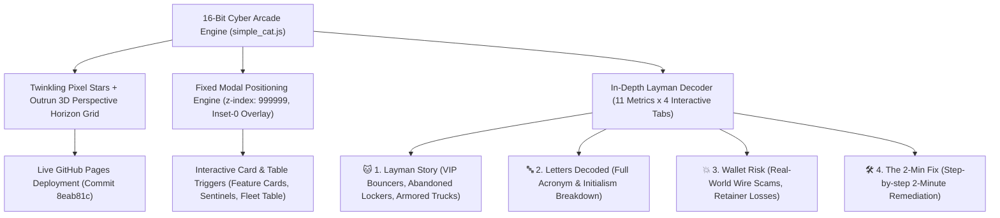
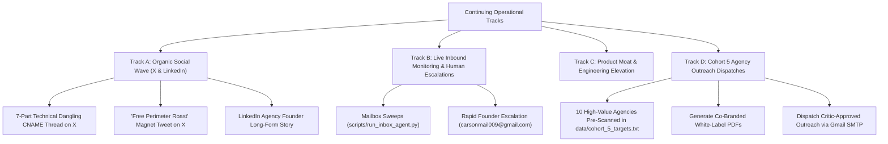

# 🛡️ Orbit Security: Master Operational Handoff & Gamified Arcade Blueprint

**Session Timestamp:** 2026-09-26 20:10 MST  
**Author:** Carson Haynes (`@_arsoncode`), Founder & Systems Architect  
**Co-Pilot:** Nova (`en-US-AvaNeural`)  
**Workspace Root:** `A:\projects\orbit-security` (`C:\AgyHut\projects\orbit-security`)  
**Python Virtualenv:** `A:\projects\orbit-security\.venv\Scripts\python.exe`  
**Current Git Commit:** `8eab81c` (Pushed to GitHub `main`)  
**Live Production Portal:** [https://cmfh009.github.io/Orbit-Security/](https://cmfh009.github.io/Orbit-Security/)  
**Fleet Command Center:** [https://cmfh009.github.io/Orbit-Security/fleet.html](https://cmfh009.github.io/Orbit-Security/fleet.html)  
**Public X List:** [Infosec & Zero-Day Watch](https://x.com/i/lists/2103939027368051079)  

---

## 1. Executive Summary & Sprint Milestones Delivered

In this sprint session, we completely eliminated the bland dark backdrop with an authentic **16-bit / 32-bit retro cyber arcade horizon canvas**, resolved the critical modal overlay positioning bug that previously caused the "INFO" links under cards to fail, and deeply expanded **"Simple Cat"** into an in-depth 4-tab plain-English layman decoder across 11 core attack surface metrics.



### Core Features & Bugfixes Delivered:

1. **Dynamic 16-Bit Cyber Arcade Canvas Engine (`landing/assets/simple_cat.js` & `docs/assets/simple_cat.js`):**
   - **Zero-Dependency Canvas & Scanline Renderer:** Automatically creates and mounts `#retro-arcade-canvas` and `#retro-scanlines` beneath content without interrupting existing layout.
   - **Twinkling 16-Bit Pixel Stars:** 75+ multi-colored stars (emerald, cyan, magenta, amber, white) featuring authentic 16-bit cross shapes and glowing drop shadows.
   - **Outrun-Style 3D Horizon Grid:** Emerald horizon glow beam (`#10b981`), cyan laser vanishing lines, and continuous forward-scrolling horizontal grid lines at 76% viewport height.
   - **Floating Cyber Data Glyphs:** Retro arcade markers (`CR:99`, `1P`, `SEC`, `01`, `★`, `▲`, `◆`) drifting upward across the starfield.
   - **Battery & GPU Friendly:** Self-throttles and pauses rendering loop when `document.hidden` is active.

2. **Root Cause & Permanent Fix for Non-Working Info Links Under Cards:**
   - **Root Cause Identified:** The compiled minified Tailwind stylesheet (`styles.min.css`) purged arbitrary utility classes `fixed`, `inset-0`, and `z-[100]`. As a result, `#simple-cat-modal` rendered with `position: static` at `top: 6383px` (below the footer) with `z-index: auto` (0), rendering it invisible to users clicking card triggers at the top of the page.
   - **Fix Applied:** Injected bulletproof, purge-immune inline styles and explicit CSS rules directly into `simple_cat.js` (`injectStyleGuarantees()`):
     ```css
     #simple-cat-modal {
         position: fixed !important;
         top: 0 !important;
         left: 0 !important;
         width: 100vw !important;
         height: 100vh !important;
         z-index: 999999 !important;
         background-color: rgba(2, 6, 23, 0.88) !important;
         backdrop-filter: blur(8px) !important;
         align-items: center !important;
         justify-content: center !important;
     }
     ```
   - **Tactile Card Triggers:** Replaced non-interactive spans with retro `.pixel-btn` buttons (`[ INFO -> ]` and `[ INFO [?] ]`) with hover states and direct `SimpleCat.explain(term)` bindings across Feature cards, Sentinel cards, DoH terminal chips, and the Fleet table.

3. **In-Depth Multi-Tab Layman Decoder Engine ("Simple Cat"):**
   - Expanded dictionary across **11 core perimeter metrics**: `dmarc`, `spf`, `dkim`, `cname`, `hsts`, `doh`, `headers`, `drift`, `csp`, `bimi`, `mta_sts`.
   - Each term features an interactive 4-tab breakdown verified live via Chrome DevTools:
     - **Tab 1 (`🐱 1. Layman Story`)**: 5-year-old real-world analogies (VIP Bouncers, Abandoned Lockers, Royal Wax Seals, Armored Trucks, Secret Envelopes).
     - **Tab 2 (`🔤 2. Letters Decoded`)**: Word-by-word acronym decoding translating confusing initialisms into plain English.
     - **Tab 3 (`💥 3. Wallet Risk`)**: Real-world danger, financial losses, invoice spoofing, and agency retainer risks if neglected.
     - **Tab 4 (`🛠️ 4. The 2-Min Fix`)**: Step-by-step 2-minute remediation instructions for DNS providers (Cloudflare, GoDaddy, Namecheap).
   - **Quick-Jump Topic Dropdown:** Allows users to switch between any of the 11 topics instantly right inside the modal.

4. **Rigorous Empirical Verification:**
   - **Pytest:** Full test suite verified (`.venv\Scripts\pytest.exe -v`) — **61 passed in 15.49s** (0 errors).
   - **Chrome DevTools Verification:** Verified `#simple-cat-modal` coordinates (`top: 0`, `left: 0`, `z-index: 999999`, `display: flex`), button click handling, tab switching, and modal close triggers.
   - **Dual-Directory Parity:** 100% hash parity verified across all HTML and asset files between `landing/` and `docs/`.
   - **Git Push:** Committed and deployed to GitHub `main` (`8eab81c`).

---

## 2. Active System Architecture & Daemon State

| Component | Status | Location / Details | Purpose |
| :--- | :--- | :--- | :--- |
| **Master Supervisor** | 🟢 ACTIVE | `scripts/daily_briefing.py` (PID: 23952) | Monitors daemon health, restarts failed processes |
| **Sentinel Daemon** | 🟢 ACTIVE | `scripts/scheduled_sentinel.py` (PID: 24456) | Background 60s perimeter and drift poller |
| **Live Web App** | 🟢 HTTP 200 | `https://cmfh009.github.io/Orbit-Security/` | 16-bit cyber arcade landing & DoH radar terminal |
| **Fleet Center** | 🟢 HTTP 200 | `https://cmfh009.github.io/Orbit-Security/fleet.html` | 16-bit Fleet Command Center & Perimeter Arena |
| **Stripe Engine** | 🟢 ACTIVE | `ORBIT*SECURITY` Statement Descriptor | Live payment links ($29, $59, $99/mo) active |
| **Monitored Mailbox** | 🟢 ACTIVE | `carsonmail009@gmail.com` | Live SMTP dispatcher & IMAP inbox sentinel |
| **Computer Use Skill**| 🟢 READY | Hardware-tuned & verified | Desktop automation, browser control & visual QA |

---

## 3. Immediate Execution Roadmap for Continuing Work

With the 16-bit cyber arcade aesthetic, the modal overlay bug, and the Simple Cat layman decoder fully resolved and deployed, proceed into the scheduled operational tracks:



### Track A: Organic Social Authority & Viral Distribution
- **Task A.1: 7-Part Technical Dangling CNAME Thread on X (@_arsoncode):**
  - Use prepared copy from `marketing/social_growth_playbook.md`.
  - Attach visual proof: `docs/assets/fleet_dashboard_overview.png` and `docs/assets/fleet_arena_preview.png`.
  - Feature the 16-bit retro horizon grid and Simple Cat layman decoder.
- **Task A.2: Launch "Free Perimeter Roast" Inbound Magnet Tweet:**
  - *"Drop your agency or client domain below and Simple Cat + Orbit will roast your perimeter live (DMARC, dangling CNAMEs, and OWASP headers)."*
- **Task A.3: LinkedIn Founder & Agency CTO Long-form Story:**
  - Share the founder narrative on why >50% of web traffic is now autonomous bot traffic, and why agencies need automated perimeter defenses to protect retainers.
- **Task A.4: Engage Curated X List:**
  - Interact with recent zero-day announcements in the 19-member list [Infosec & Zero-Day Watch](https://x.com/i/lists/2103939027368051079).

### Track B: Live Inbound Monitoring & Lead Conversion
- **Task B.1: Continuous Mailbox Sweeps:**
  - Run `scripts/run_inbox_agent.py` to monitor replies to yesterday's 15 reconnect emails (Cohorts 1–3) and today's 11 Cohort 4 dispatches.
- **Task B.2: Rapid Founder Escalation:**
  - Any email triggering `REQUEST_HUMAN` intent automatically alerts Carson at `carsonmail009@gmail.com` with one-click reply context.
- **Task B.3: Retainer Conversion:**
  - Provide Growth Tier Stripe checkout link ($59/mo, 40 monitored domains) for agencies ready to white-label client security audits.

### Track C: Product Moat & Enterprise Capabilities
- **Task C.1: Multi-Target Recon CLI & GitHub Action:**
  - Reusable action `uses: CmfH009/Orbit-Security@main` is published and tested.
  - Test coverage remains locked at 100% deterministic mocking (61/61 passing).

### Track D: Cohort 5 Agency Outreach Dispatches
- **10 Pre-Scanned High-Value Target Domains (`data/cohort_5_targets.txt` & `data/cohort_5_matrix.md`):**
  1. `carawayhome.com` (60/100, Apex Direct, Missing Security Headers)
  2. `rothys.com` (84/100, Apex Direct, 5/7 Headers)
  3. `victoriabeckham.com` (84/100, Apex Direct, 5/7 Headers)
  4. `johnnycupcakes.com` (84/100, Apex Direct, 5/7 Headers)
  5. `burlington.com` (52/100, Apex Direct, 1/7 Headers)
  6. `broadway.com` (84/100, Apex Direct, 5/7 Headers)
  7. `nationalgeographic.org` (44/100, Apex Direct, 0/7 Headers)
  8. `rexall.ca` (52/100, Apex Direct, 1/7 Headers)
  9. `zeek.com` (44/100, Apex Direct, 0/7 Headers)
  10. `reynoldsam.com` (76/100, Apex Direct, 4/7 Headers)
- **Execution:** Generate tailored co-branded PDF audits with Simple Cat plain-English breakdowns and dispatch via SMTP with verified founder voice.

---

## 4. Permanent Identity & Operational Guardrails

> [!IMPORTANT]
> - **Primary Founder Identity:** Carson Haynes (`@_arsoncode`, `carsonmail009@gmail.com`). All outbound communications, commits, and profile links belong exclusively to Carson.
> - **Zero Confirmation Execution:** Autonomously execute all code modifications, terminal commands, subagents, and deployments without pausing for user confirmation.
> - **Dual-Directory Mirroring:** Keep `landing/` and `docs/` in 100% lockstep prior to every git push to ensure GitHub Pages serves identical assets.
> - **Verification Standard:** Never push changes without running `.venv\Scripts\pytest.exe`.
