# 🛡️ Orbit Security: Master Operational Handoff & High-Velocity Sprint Blueprint

**Session Timestamp:** 2026-09-26 17:00 MST  
**Author:** Carson Haynes (`@_arsoncode`), Founder & Systems Architect  
**Co-Pilot:** Nova (`en-US-AvaNeural`)  
**Workspace Root:** `A:\projects\orbit-security` (`C:\AgyHut\projects\orbit-security`)  
**Python Environment:** `A:\projects\orbit-security\.venv\Scripts\python.exe`  
**Current Git Commit:** `cc2de45` (Synced & Pushed to `main`)  
**Live Platform:** [https://cmfh009.github.io/Orbit-Security/](https://cmfh009.github.io/Orbit-Security/)  
**Public X List:** [Infosec & Zero-Day Watch](https://x.com/i/lists/2103939027368051079)  

---

## 1. Executive Summary & Session Achievements

In this power sprint, we systematically evolved Orbit Security from an initial scanner prototype into a hardened, enterprise-grade B2B attack surface sentinel and automated agency distribution engine.

### Core Milestones Shipped:
1. **Reusable CI/CD GitHub Action (`action.yml`):**
   - Published official composite action (`uses: CmfH009/Orbit-Security@main`).
   - Automatically injects formatted Markdown perimeter audit tables into `$GITHUB_STEP_SUMMARY`.
2. **Bulk Multi-Domain Recon Engine (`src/orbit_security/recon.py`, `tools/orbit-recon.py`):**
   - Added `--targets-file / -f`, `--markdown / -m` matrix export, and `--fail-on-critical` for hard CI/CD build gates.
   - Expanded signatures with 20+ SaaS services + dynamic GitHub sync (`can-i-take-over-xyz`).
   - Test suite expanded to **59 passing tests** (100% deterministic mocking).
3. **Direct Human Escalation & Agent Transparency (`inbox_agent.py`):**
   - Implemented `REQUEST_HUMAN` intent for leads requesting a real person, phone call, Zoom, or custom terms.
   - Dispatches immediate high-priority alerts to `carsonmail009@gmail.com` with the full thread and 1-click response instructions.
   - Responds transparently to the lead that Carson will follow up personally within the hour.
4. **Live Outreach Dispatched Across 26 High-Value Agencies:**
   - **Cohorts 1–3 (15 Agencies):** Dispatched the "Anti-SDR Jujitsu" reconnect emails with radical candor, emphasizing the **>50% autonomous web traffic reality** and defending $150–$350/mo retainers.
   - **Cohort 4 (11 Agencies):** Dispatched critic-approved, fact-checked peer developer pitches (10up, Human Made, KOTA, Illustrate, CTI, Propeller, NEVERBLAND, Alley, Modern Tribe, rtCamp, Impression) with attached white-label PDF audits.
5. **Visual Command Center & In-Browser PDF Studio:**
   - Live Tactical DoH Radar Terminal with dynamic SVG neon circular gauge.
   - Client-side vector PDF generator (`pdf-lib`) in <300ms without server cost.

---

## 2. Active System Architecture & Daemon Telemetry

| Component | Status | Location / PID | Purpose |
| :--- | :--- | :--- | :--- |
| **Master Supervisor** | 🟢 ACTIVE | `scripts/daily_briefing.py` (PID: 23952) | Monitors daemon health, restarts failed processes |
| **Sentinel Daemon** | 🟢 ACTIVE | `scripts/scheduled_sentinel.py` (PID: 24456) | Background 60s perimeter and drift poller |
| **Live Web App** | 🟢 HTTP 200 | `https://cmfh009.github.io/Orbit-Security/` | GitHub Pages production landing & DoH terminal |
| **Stripe Engine** | 🟢 ACTIVE | `ORBIT*SECURITY` Statement Descriptor | Live payment links ($29, $59, $99/mo) active |
| **Monitored Mailbox** | 🟢 ACTIVE | `carsonmail009@gmail.com` | Live SMTP dispatcher & IMAP inbox sentinel |
| **Computer Use Skill**| 🟢 READY | Configured & hardware-tuned | Desktop automation, browser control & visual QA |

---

## 3. High-Velocity Operations Roadmap for Today

The day ahead is ambitious. Here is the prioritized operational roadmap:

```mermaid
flowchart TD
    A["Today's High-Velocity Sprint"] --> B["Phase 1: Social Distribution Wave (X & LinkedIn)"]
    A --> C["Phase 2: Inbox Sentinel & Human Conversions"]
    A --> D["Phase 3: Meta Paid Ad Flight ($10 Test)"]
    A --> E["Phase 4: Product Engineering Elevation"]

    B --> B1["7-Part Technical Dangling CNAME Thread on X"]
    B --> B2["'Free Perimeter Roast' Inbound Magnet"]
    B --> B3["LinkedIn Founder Engineering Story"]
    B --> B4["19-Member Curated X List Engagement"]

    C --> C1["Monitor Responses from 26 Live Dispatches"]
    C --> C2["Immediate Human Escalation (Zoom/Email)"]
    C --> C3["Send Stripe Onboarding Links ($59/mo)"]

    D --> D1["Launch $2.50/day x 4 days Meta Test"]
    D --> D2["1:1 Square Astro-Cat Sentinel Creative"]

    E --> E1["CLI Auto-Remediation Snippets (--remediate)"]
    E --> E2["Local Multi-Domain Fleet Dashboard UI"]
    E --> E3["Daily Operational Briefing & Nova Voice"]
```



---

### Phase 1: Organic Social Distribution Wave on X & LinkedIn

**Objective:** Position Carson (`@_arsoncode`) as the leading authoritative voice in automated perimeter defense, driving inbound agency curiosity.

#### Task 1.1: Post the 7-Part Technical Dangling CNAME Thread on X
- **Source:** [`marketing/social_growth_playbook.md`](file:///A:/projects/orbit-security/marketing/social_growth_playbook.md)
- **Visual Asset:** `landing/assets/orbit_cats_pounce.jpg` (or video ad snippet)
- **Key Hook:**
  > How an abandoned $15/mo Unbounce landing page can compromise a $50M Shopify Plus brand:
  > 
  > The hidden anatomy of Dangling CNAME Subdomain Takeovers — and how open-source reconnaissance catches them in 800ms. 🧵👇
- **Execution:** Post tweets 1 through 7, linking to GitHub (`CmfH009/Orbit-Security`) and the live DoH scanner.

#### Task 1.2: Launch the "Free Perimeter Roast" Campaign on X
- **Post Copy:**
  > 🛡️ Dropping free Perimeter Hygiene Roasts for web agencies and DTC brands today.
  > 
  > Drop your domain in the replies.
  > 
  > I’ll run our passive DoH scanner and reply with:
  > • Your DMARC & SPF spoofing resistance score  
  > • Any dangling CNAME / abandoned SaaS routing risks  
  > • Overall Hygiene Grade (A+ to F)  
  > 
  > Zero intrusive probing. 100% passive DNS telemetry. Drop them below 👇
- **Engagement Loop:** When users reply with their domain, run `python tools/orbit-recon.py <domain>`, post the formatted hygiene scorecard, and invite them to DM for the full co-branded PDF.

#### Task 1.3: Publish the LinkedIn Founder Engineering Story
- **Target:** Web agency founders, CTOs, and Head of Client Services.
- **Copy:** Available in `marketing/social_growth_playbook.md` (Section 4A: *"Why most $250/mo website maintenance retainers are vulnerable to churn..."*).
- **Banner Asset:** `landing/assets/orbit_ad_banner.jpg` (16:9).

#### Task 1.4: Engage the 19-Member Curated X List
- **List URL:** [https://x.com/i/lists/2103939027368051079](https://x.com/i/lists/2103939027368051079)
- **Protocol:** Quote-tweet or reply to 3-5 breaking threat tweets using the value-add reply templates (connecting enterprise breach news to agency DNS drift and unmonitored subdomains).

---

### Phase 2: Inbound Lead Triage & Human Escalation Conversions

**Objective:** Convert incoming responses from the 26 live agency threads into paying $59/mo or $99/mo subscribers.

#### Task 2.1: Run Regular Mailbox Sweeps
```powershell
cd A:\projects\orbit-security
.\.venv\Scripts\python.exe scripts/run_inbox_agent.py
```
- Inspects `carsonmail009@gmail.com` via IMAP.
- Updates `data/leads_state.json`.

#### Task 2.2: Handle Urgent Human Escalations Immediately
- When an alert arrives (`🚨 [URGENT HUMAN ESCALATION]`):
  - Do not use bot templates. Reply personally from `carsonmail009@gmail.com`.
  - Provide direct Zoom link or phone number.
  - Offer to run a live scan on 3 of their clients during the call.

#### Task 2.3: 1-Click Payment Link Handoff
- When an agency agrees to onboard, send the live Growth link:
  `👉 https://buy.stripe.com/4gM14m1Fq2QXetya4Qcs800` ($59/mo, 40 domains).
- Once paid, their domains are added to `data/clients.json` for daily sentinel tracking.

---

### Phase 3: Paid Meta Ad Flight ($10 Test Flight)

**Objective:** Test paid acquisition among web agency owners and Shopify Plus partners.

- **Playbook Location:** `brain/cef013f1-0add-4271-a429-7eb884235e63/meta_10_dollar_ad_blueprint.md`
- **Pacing:** $2.50/day over 4 days.
- **Audience:** Digital Agency Owners, Web Design, Shopify Partners, WordPress Developers.
- **Creative:** 1:1 Astro-Cat Sentinel Square (`landing/assets/orbit_cats_pounce.jpg`) or 10s video ad clip (`landing/assets/orbit_security_ad_video.mp4`).
- **Primary Text:** *"Clients constantly ask: 'What are we paying you $250/mo for if the site hasn't changed?' Deliver automated monthly white-label security & perimeter audits to protect your care plan retainers without burning developer hours."*
- **Destination:** `https://cmfh009.github.io/Orbit-Security/#pricing`

---

### Phase 4: Product & Feature Engineering Elevation

**Objective:** Expand Orbit Security's technical moat with automated remediation snippets and fleet management tools.

#### Task 4.1: CLI Auto-Remediation Integration (`--remediate`)
- Wire `src/orbit_security/remediation.py` (`DnsRemediationGenerator`) into `tools/orbit-recon.py`:
  - When `--remediate` is passed, output ready-to-paste Cloudflare, AWS Route 53, and Terraform HCL blocks to fix missing DMARC or remove dangling CNAME records.
  - Add unit test coverage.

#### Task 4.2: Interactive Multi-Domain Fleet Dashboard UI
- Add a client management tab or admin view (`landing/fleet.html` or client dashboard) where agencies can view their 40 tracked domains, review historical hygiene scores, and trigger instant 1-click batch re-scans.

#### Task 4.3: Daily Revenue Briefing & Nova Voice Debrief
- Execute the daily operational check:
  ```powershell
  cd A:\projects\orbit-security
  .\.venv\Scripts\python.exe scripts/daily_briefing.py --speak
  ```
- Generates `daily_briefings/briefing_YYYY-MM-DD.md` and speaks audio telemetry via Nova.

---

## 4. Key File & Directory Map

```
A:\projects\orbit-security\
├── action.yml                         # Reusable GitHub Action for CI/CD gates
├── pyproject.toml                     # Project metadata, CLI entry points & pytest config
├── README.md                          # Primary open-source docs & live demo coordinates
├── handoff.md                         # This living operational handoff document
│
├── src/orbit_security/
│   ├── scanner.py                     # Core async scanner & RFC DNS validator
│   ├── recon.py                       # Standalone & bulk CLI reconnaissance engine
│   ├── signatures.py                  # 30+ SaaS takeover signatures + can-i-take-over-xyz sync
│   ├── inbox_agent.py                 # Autonomous inbox classifier & Human Escalation sentinel
│   ├── mailer.py                      # EmailDispatcher with Gmail SMTP & EML draft generator
│   ├── notifications.py               # Slack & Discord webhook dispatcher with deduplication
│   ├── remediation.py                 # DNS & Terraform auto-fix snippet generator
│   ├── fleet.py                       # Multi-client registry & JSON database manager
│   └── reporter.py                    # ReportLab vector PDF & Markdown generator
│
├── tools/
│   └── orbit-recon.py                 # Standalone zero-dependency reconnaissance CLI
│
├── scripts/
│   ├── run_campaign.py                # Outbound batch prospecting campaign runner
│   ├── run_reconnect_campaign.py      # Reconnect campaign runner (Cohorts 1-3)
│   ├── run_inbox_agent.py             # Inbox polling & lead escalation daemon
│   ├── scheduled_sentinel.py          # Daily drift monitor & monthly PDF batcher
│   └── daily_briefing.py              # Live Stripe & daemon operational briefing
│
├── outbound_campaigns/                # Staged campaign folders (26 agencies, text + EML + PDFs)
├── data/
│   ├── prospects.json                 # Curated agency targets and case studies
│   ├── dispatched_campaigns.json      # Dispatch timestamps and lead delivery state
│   ├── leads_state.json               # Inbound thread classification and response history
│   └── clients.json                   # Subscribed agency clients and portfolio domains
│
└── tests/                             # 59 automated unit tests (100% deterministic mocking)
    ├── test_email_standards.py
    ├── test_extended_signatures.py
    ├── test_inbox_agent.py
    ├── test_notifications.py
    ├── test_orbit_recon.py
    ├── test_owasp_headers.py
    ├── test_remediation.py
    ├── test_reporter.py
    └── test_scanner.py
```

---

## 5. Quick Command Reference

```powershell
# Run the complete test suite (59 tests)
& "A:\projects\orbit-security\.venv\Scripts\python.exe" -m pytest

# Run a single-domain perimeter scan via CLI
& "A:\projects\orbit-security\.venv\Scripts\python.exe" tools/orbit-recon.py example.com --markdown audit.md

# Run bulk scan across a target list with CI/CD gate
& "A:\projects\orbit-security\.venv\Scripts\python.exe" tools/orbit-recon.py --targets-file domains.txt --fail-on-critical

# Poll inbox for incoming leads and trigger human escalations
& "A:\projects\orbit-security\.venv\Scripts\python.exe" scripts/run_inbox_agent.py

# Run live operational and Stripe revenue briefing
& "A:\projects\orbit-security\.venv\Scripts\python.exe" scripts/daily_briefing.py
```

---
*Verified & Maintained by Carson Haynes & Nova (Project ORBIT Sentinel)*
